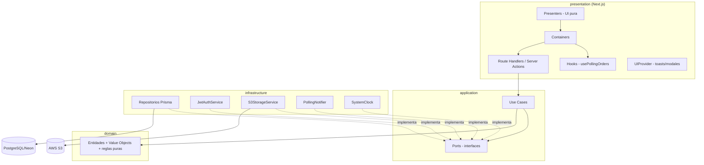
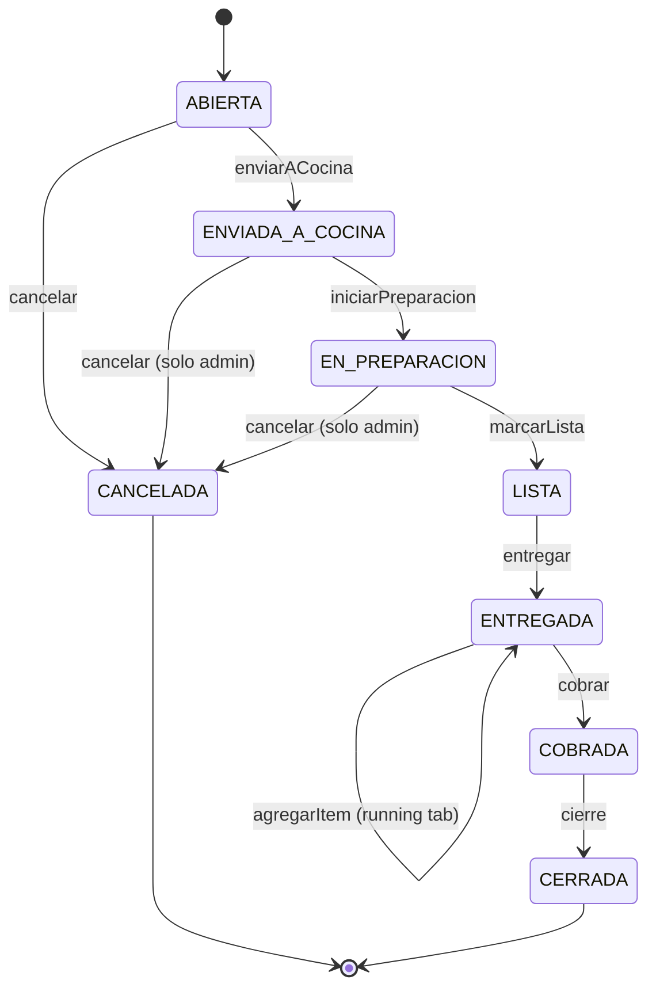
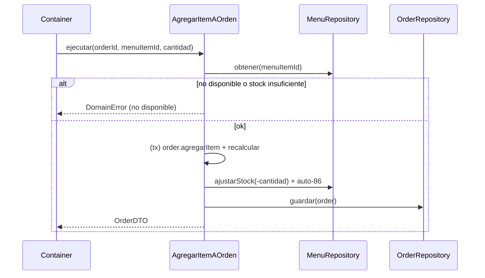
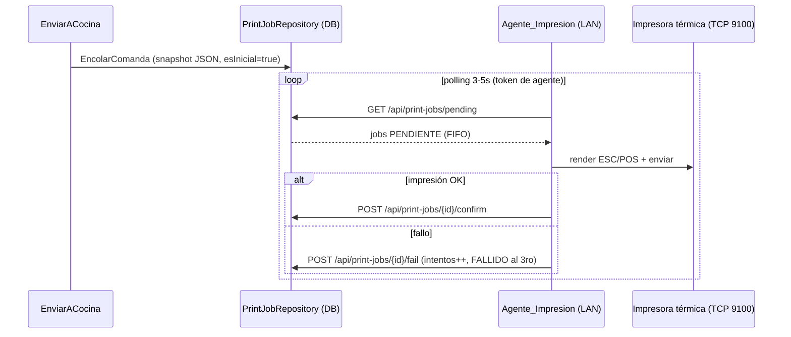

# Documento de Diseño

## Overview

Camarones Louisiana es un **monolito modular** en Next.js (App Router, TypeScript) construido bajo **Clean Architecture + SOLID**. La regla de dependencia apunta hacia adentro: `presentation → application → domain`. El dominio no conoce Next, Prisma ni ningún SDK. La infraestructura implementa los puertos definidos por la capa de aplicación, y la presentación (route handlers, server actions y UI Container/Presenter) consume los casos de uso.

Este diseño traduce los 18 requisitos en una arquitectura concreta: un modelo de datos Prisma sobre PostgreSQL (Neon), casos de uso que orquestan reglas de negocio puras, y facades sobre los servicios externos (auth, storage, realtime, impresión) que permiten sustituir tecnología sin tocar el core.

### Objetivos de diseño

- **Aislar el dominio**: reglas de caja, totales y máquina de estados son código puro, testeable sin DB ni HTTP.
- **Auditabilidad del dinero**: todo evento de plata es un `MovimientoCaja` inmutable; el cierre se deriva de la suma de movimientos, nunca de un saldo mutable.
- **Sustituibilidad**: facades para Auth, Storage y Realtime dejan SRI, OCR, WebSocket o Cognito como cambios futuros localizados en infraestructura.
- **Robustez operativa**: polling con defensa en capas para cocina; transacciones para operaciones que tocan stock + estado + caja a la vez.

### Mapa de requisitos a componentes

| Requisito | Componente principal | Casos de uso |
|-----------|---------------------|--------------|
| R1, R2 | Servicio_Auth, Gestor_Usuarios | `Login`, middleware, `GestionarUsuarios` |
| R3 | Gestor_Menu | `GestionarMenu`, `AjustarStock` |
| R4, R5, R6 | Gestor_Ordenes | `CrearOrden`, `AgregarItemAOrden`, `QuitarItem`, `EnviarACocina`, `EntregarOrden` |
| R7 | Gestor_Ordenes + Registro_Auditoria | `CancelarOrden` |
| R8 | Dominio `Order` (cálculo de totales) | (puro, sin caso de uso dedicado) |
| R9 | Gestor_Pagos | `CobrarOrden` |
| R10, R11, R12, R13 | Gestor_Caja | `AbrirCaja`, `Registrar*`, `RegistrarPagoCarrera`, `CerrarCaja` |
| R14, R15 | Gestor_Cocina, Notificador_Realtime | `MarcarOrdenLista`, `usePollingOrders` |
| R16 | Registro_Auditoria | (efecto transversal de acciones sensibles) |
| R17 | Proveedor_UI | (componentes UI: UIProvider, modales, toasts) |
| R18 | Servicio_Impresion + Agente_Impresion | `EncolarComanda`, `ConfirmarImpresion`, `ReimprimirComanda` |

## Architecture

### Diagrama de capas



### Estructura de carpetas

```
src/
  domain/
    order/      Order.ts, OrderItem.ts, OrderStatus.ts, OrderChannel.ts, Money.ts
    menu/       MenuItem.ts, Category.ts
    caja/       CajaSession.ts, MovimientoCaja.ts, TipoMovimiento.ts, Libro.ts
    user/       User.ts, Role.ts, Permiso.ts
    audit/      AuditEntry.ts
    print/      PrintJob.ts, PrintJobStatus.ts
    shared/     DomainError.ts, Result.ts
  application/
    ports/      OrderRepository.ts, MenuRepository.ts, CajaRepository.ts,
                UserRepository.ts, AuditRepository.ts, PrintJobRepository.ts,
                AuthService.ts, StorageService.ts, RealtimeNotifier.ts, Clock.ts
    use-cases/
      orders/   CrearOrden.ts, AgregarItemAOrden.ts, QuitarItem.ts,
                EnviarACocina.ts, EntregarOrden.ts, CobrarOrden.ts, CancelarOrden.ts
      cocina/   IniciarPreparacion.ts, MarcarOrdenLista.ts
      caja/     AbrirCaja.ts, RegistrarPagoCarrera.ts, RegistrarPagoProveedor.ts,
                RegistrarCompraMenor.ts, IngresoRetiroManual.ts, CerrarCaja.ts
      menu/     GestionarMenu.ts, AjustarStock.ts
      auth/     Login.ts, GestionarUsuarios.ts
      print/    EncolarComanda.ts, ConfirmarImpresion.ts, ReimprimirComanda.ts
  infrastructure/
    db/         prisma.ts, repositories/ (PrismaOrderRepository.ts, ...)
    storage/    S3StorageService.ts
    auth/       JwtAuthService.ts
    realtime/   PollingNotifier.ts
    clock/      SystemClock.ts
    di/         container.ts (composición de dependencias)
  presentation/
    http/       apiError.ts (DomainError.code→status), apiSession.ts
                (requireSession/requireAdmin), serializers.ts (entidad→DTO),
                respond.ts, orderTransition.ts
    components/
      presenters/   (UI pura)
      containers/   (wiring a casos de uso)
      ui/           (UIProvider, Modal, Toast)
    hooks/      usePollingOrders.ts, useWakeLock.ts, useAudioUnlock.ts
  app/
    api/        auth/login, orders (+[id]/enviar-cocina|iniciar|lista|entregar|
                cobrar|cancelar|items), orders/active, menu (+[id], stock),
                caja/abrir|cerrar|movimientos, users (+[id]), audit
  middleware.ts (protección de rutas por rol/permiso, edge)
prisma/
  schema.prisma
```

### Composición de dependencias (DI)

`infrastructure/di/container.ts` ensambla los casos de uso con sus implementaciones concretas. Los route handlers piden casos de uso al contenedor; nunca instancian repositorios directamente. Esto mantiene la regla de dependencia y facilita el reemplazo de implementaciones en tests (fakes en memoria).

## Data Models

```prisma
// Conexión Neon: DATABASE_URL pooled (runtime), DIRECT_URL directo (migraciones)
datasource db {
  provider  = "postgresql"
  url       = env("DATABASE_URL")
  directUrl = env("DIRECT_URL")
}

enum Role { MESERO COCINA OPERADOR ADMIN }

enum OrderChannel { SALON DELIVERY RETIRAR }

enum OrderStatus {
  ABIERTA ENVIADA_A_COCINA EN_PREPARACION LISTA
  ENTREGADA COBRADA CERRADA CANCELADA
}

enum MetodoPago { EFECTIVO TRANSFERENCIA }

enum Libro { EFECTIVO TRANSFERENCIA }

enum TipoMovimiento {
  APERTURA VENTA_EFECTIVO VENTA_TRANSFERENCIA PAGO_CARRERA
  PAGO_PROVEEDOR COMPRA_MENOR INGRESO_MANUAL RETIRO_MANUAL CIERRE
}

enum CajaEstado { ABIERTA CERRADA }

model User {
  id           String   @id @default(cuid())
  usuario      String   @unique
  claveHash    String
  nombre       String
  roles        Role[]
  puedeCobrar  Boolean  @default(false)
  activo       Boolean  @default(true)
  createdAt    DateTime @default(now())
  ordenes      Order[]
  movimientos  MovimientoCaja[]
  auditorias   AuditEntry[]
}

model Category {
  id        String     @id @default(cuid())
  nombre    String     @unique
  items     MenuItem[]
}

model MenuItem {
  id          String     @id @default(cuid())
  nombre      String
  categoriaId String
  categoria   Category   @relation(fields: [categoriaId], references: [id])
  precio      Decimal    @db.Decimal(10, 2)
  fotoUrl     String?
  stockDelDia Int        @default(0)
  disponible  Boolean    @default(true)
  items       OrderItem[]
}

model Order {
  id           String       @id @default(cuid())
  numero       Int          @unique @default(autoincrement())
  canal        OrderChannel
  estado       OrderStatus  @default(ABIERTA)
  mesa         Int?
  clienteNombre   String?
  clienteDireccion String?
  clienteTelefono  String?
  envio        Decimal      @db.Decimal(10, 2) @default(0)
  envases      Decimal      @db.Decimal(10, 2) @default(0)
  subtotal     Decimal      @db.Decimal(10, 2) @default(0)
  total        Decimal      @db.Decimal(10, 2) @default(0)
  metodoPago   MetodoPago?
  comprobanteUrl String?
  creadoPorId  String
  creadoPor    User         @relation(fields: [creadoPorId], references: [id])
  items        OrderItem[]
  movimientos  MovimientoCaja[]
  printJobs    PrintJob[]
  createdAt    DateTime     @default(now())
  updatedAt    DateTime     @updatedAt

  @@index([estado])
}

model OrderItem {
  id           String   @id @default(cuid())
  orderId      String
  order        Order    @relation(fields: [orderId], references: [id], onDelete: Cascade)
  menuItemId   String
  menuItem     MenuItem @relation(fields: [menuItemId], references: [id])
  nombrePlato  String   // snapshot del nombre al momento del pedido
  precioUnit   Decimal  @db.Decimal(10, 2) // snapshot del precio
  cantidad     Int
}

model CajaSession {
  id              String           @id @default(cuid())
  fecha           DateTime
  fondoInicial    Decimal          @db.Decimal(10, 2)
  estado          CajaEstado       @default(ABIERTA)
  efectivoContado Decimal?         @db.Decimal(10, 2)
  diferencia      Decimal?         @db.Decimal(10, 2)
  firmadoPorId    String?
  movimientos     MovimientoCaja[]
  createdAt       DateTime         @default(now())
  closedAt        DateTime?
}

model MovimientoCaja {
  id                   String         @id @default(cuid())
  sesionId             String
  sesion               CajaSession    @relation(fields: [sesionId], references: [id])
  tipo                 TipoMovimiento
  libro                Libro
  monto                Decimal        @db.Decimal(10, 2) // con signo
  orderId              String?
  order                Order?         @relation(fields: [orderId], references: [id])
  categoria            String?
  esCarreraPassthrough Boolean        @default(false)
  empleadoId           String
  empleado             User           @relation(fields: [empleadoId], references: [id])
  nota                 String?
  timestamp            DateTime       @default(now())

  @@index([sesionId, libro])
}

enum PrintJobStatus { PENDIENTE IMPRESO FALLIDO }

enum PrintJobTipo { INICIAL ADICION REIMPRESION }

model PrintJob {
  id         String         @id @default(cuid())
  orderId    String
  order      Order          @relation(fields: [orderId], references: [id])
  tipo       PrintJobTipo
  // Snapshot estructurado de la comanda (número, canal, mesa/dirección,
  // hora, ítems con cantidad; en ADICION solo los ítems agregados). El
  // agente lo renderiza a ESC/POS; la nube es agnóstica de la marca.
  contenido  Json
  estado     PrintJobStatus @default(PENDIENTE)
  intentos   Int            @default(0)
  // true solo cuando tipo=INICIAL; NULL en ADICION/REIMPRESION. Postgres
  // trata los NULL como distintos, así el índice único permite N adiciones
  // y reimpresiones pero un solo INICIAL por orden (R18.8).
  esInicial  Boolean?
  createdAt  DateTime       @default(now())
  printedAt  DateTime?

  @@unique([orderId, esInicial], name: "unico_job_inicial")
  @@index([estado, createdAt])
}

model AuditEntry {
  id          String   @id @default(cuid())
  usuarioId   String
  usuario     User     @relation(fields: [usuarioId], references: [id])
  accion      String   // p.ej. CANCELAR_ORDEN, ABRIR_CAJA, OVERRIDE_PRECIO
  entidadTipo String   // Order, CajaSession, MenuItem
  entidadId   String
  detalle     Json?
  timestamp   DateTime @default(now())

  @@index([timestamp])
}
```

### Decisiones de modelado

- **`Decimal(10,2)`** para todo monto: evita errores de coma flotante en dinero. En el dominio se envuelve en un value object `Money` que opera en centavos enteros.
- **Snapshots en `OrderItem`** (`nombrePlato`, `precioUnit`): el total histórico de una orden no cambia si luego se edita el precio o nombre del plato.
- **`numero` autoincremental** en `Order`: el "#N" visible para usuarios; el `id` (cuid) es la clave técnica.
- **Movimientos inmutables**: no hay update/delete de `MovimientoCaja` en la capa de aplicación. Correcciones se hacen con movimientos compensatorios (`INGRESO_MANUAL`/`RETIRO_MANUAL`).
- **`roles` como array de enum**: soporta la asunción 1 (un usuario, varios roles). `puedeCobrar` es un flag separado y asignable (Permiso_Cobrar desacoplado del rol).

## Components and Interfaces

### Dominio

### Value Object `Money`

Encapsula montos como enteros (centavos) para aritmética exacta. Métodos: `suma`, `resta`, `multiplica(cantidad)`, `esCero`, `negativo`, `toDecimal`. Las conversiones a/desde `Decimal` de Prisma ocurren en los repositorios.

### Entidad `Order` y cálculo de totales (R8)

`Order` concentra el cálculo de montos como funciones puras:

```typescript
// dominio puro, sin dependencias externas
class Order {
  recalcular(): void {
    this.subtotal = this.items.reduce(
      (acc, it) => acc.suma(it.precioUnit.multiplica(it.cantidad)),
      Money.cero()
    );
    this.envases = (this.canal === 'DELIVERY' || this.canal === 'RETIRAR')
      ? Money.de(0.50) : Money.cero();
    // envio solo aplica en DELIVERY; cero en otros canales
    const envio = this.canal === 'DELIVERY' ? this.envio : Money.cero();
    this.total = this.subtotal.suma(this.envases).suma(envio);
  }
}
```

### Máquina de estados (R6, R7)

Las transiciones válidas se definen como un mapa puro. `Order.transicionarA(nuevoEstado, contexto)` valida contra la tabla y lanza `DomainError` si la transición no está permitida (R6.7).



Tabla de transiciones permitidas (origen → destinos):

| Origen | Destinos permitidos | Restricción |
|--------|--------------------|-----------|
| ABIERTA | ENVIADA_A_COCINA, CANCELADA | cancelar: cualquier autorizado |
| ENVIADA_A_COCINA | EN_PREPARACION, CANCELADA | cancelar: solo admin |
| EN_PREPARACION | LISTA, CANCELADA | cancelar: solo admin |
| LISTA | ENTREGADA | |
| ENTREGADA | ENTREGADA (running tab), COBRADA | |
| COBRADA | CERRADA | cancelar COBRADA: solo admin (audita) |
| CERRADA / CANCELADA | (terminal) | |

### Puertos (interfaces de aplicación)

```typescript
interface OrderRepository {
  crear(order: Order): Promise<Order>;
  obtener(id: string): Promise<Order | null>;
  activas(): Promise<Order[]>;            // para KDS (R14)
  guardar(order: Order): Promise<void>;
  // operaciones transaccionales se exponen vía unitOfWork
}

interface MenuRepository {
  listar(): Promise<MenuItem[]>;
  obtener(id: string): Promise<MenuItem | null>;
  guardar(item: MenuItem): Promise<void>;
  ajustarStock(id: string, delta: number): Promise<MenuItem>; // atómico
}

interface CajaRepository {
  sesionAbierta(): Promise<CajaSession | null>;
  crearSesion(s: CajaSession): Promise<CajaSession>;
  agregarMovimiento(m: MovimientoCaja): Promise<void>;
  movimientosDeSesion(sesionId: string): Promise<MovimientoCaja[]>;
  cerrarSesion(s: CajaSession): Promise<void>;
}

interface UserRepository {
  porUsuario(usuario: string): Promise<User | null>;
  obtener(id: string): Promise<User | null>;
  listar(): Promise<User[]>;
  guardar(u: User): Promise<void>;
}

interface AuditRepository {
  registrar(entry: AuditEntry): Promise<void>;
  listar(filtro?: AuditFiltro): Promise<AuditEntry[]>;
}

interface AuthService {                    // facade
  verificarClave(clave: string, hash: string): Promise<boolean>;
  hashClave(clave: string): Promise<string>;
  emitirSesion(user: SessionUser): Promise<string>;   // JWT
  verificarSesion(token: string): Promise<SessionUser | null>;
}

interface StorageService {                 // facade S3
  subirComprobante(orderId: string, archivo: Buffer, mime: string): Promise<string>; // URL
}

interface RealtimeNotifier {               // facade polling/ws
  notificarCambio(canal: string): Promise<void>;
}

interface PrintJobRepository {             // cola de impresión (R18)
  encolar(job: PrintJob): Promise<void>;
  pendientes(): Promise<PrintJob[]>;       // FIFO, para el Agente_Impresion
  obtener(id: string): Promise<PrintJob | null>;
  guardar(job: PrintJob): Promise<void>;   // confirmación / intentos / fallo
  inicialDeOrden(orderId: string): Promise<PrintJob | null>; // idempotencia
}

interface Clock {
  now(): Date;
}
```

### Casos de Uso Clave

### CrearOrden (R4)

Valida que el canal traiga sus datos requeridos (mesa para SALON, dirección para DELIVERY), crea la orden en estado ABIERTA. Errores de validación retornan `DomainError` mapeado a 422.

### AgregarItemAOrden / QuitarItem (R3, R5)

Operación **transaccional** (unit of work): verifica `disponible`, agrega/quita el `OrderItem`, ajusta `stockDelDia` (decrementa al agregar, incrementa al quitar), aplica auto-86 (si stock llega a 0 → `disponible=false`), y recalcula totales de la orden. Permitido solo en estados `ABIERTA`, `EN_PREPARACION`, o `ENTREGADA` (running tab, solo agregar).



### EnviarACocina, IniciarPreparacion, MarcarOrdenLista, EntregarOrden (R6, R15)

Cada uno valida la transición vía `Order.transicionarA` y persiste. `MarcarOrdenLista` y `EnviarACocina` disparan `RealtimeNotifier.notificarCambio('orders')` para refrescar el KDS. `EnviarACocina` invoca además `EncolarComanda` tipo `INICIAL` (R18.1) tras persistir la transición, y `AgregarItemAOrden` invoca `EncolarComanda` tipo `ADICION` con solo los ítems agregados cuando la orden ya está en `EN_PREPARACION` o `ENTREGADA` (R18.9); ambos de forma no bloqueante.

### Impresión de comandas (R18)

**Decisión de arquitectura**: el backend corre serverless (Amplify/Lambda) y no puede abrir TCP hacia la impresora en la LAN del restaurante. Se usa una **cola persistente de trabajos** (`PrintJob` en PostgreSQL) consumida por un **Agente_Impresion** en la red local, siguiendo el mismo patrón de polling del KDS.

Opciones evaluadas:

| Opción | Veredicto |
|--------|-----------|
| TCP directo Next.js → impresora (9100) | Inviable desde Lambda; solo funcionaría self-hosted en la LAN |
| **Cola en DB + agente local (elegida)** | Agnóstica de marca, mismo patrón polling, reintentos y trazabilidad gratis, testeable con fakes |
| Epson Server Direct Print (la impresora hace polling) | Lock-in Epson y formato propio; queda como optimización futura: consumiría la misma cola |

Flujo:



Reglas de diseño:

- **No bloqueante (R18.7)**: la operación de negocio (envío a cocina, adición de ítem) se persiste primero; un fallo al encolar se registra y no la revierte. El KDS es la fuente de verdad.
- **Idempotencia (R18.8)**: índice único `(orderId, esInicial)` con `esInicial=true` solo en jobs `INICIAL` (NULL en el resto) — reintentos de `EnviarACocina` no duplican la comanda inicial; adiciones y reimpresiones son ilimitadas.
- **Adiciones, no reimpresiones (R18.9)**: agregar ítems a una orden ya en cocina imprime un `Ticket_Adicion` con encabezado "ADICIÓN · orden #N" y **solo** los ítems nuevos. Nunca se reimprime automáticamente la comanda completa: cocina vería platos ya preparados y cocinaría doble.
- **Snapshot en `contenido` (Json)**: la comanda se congela al encolar (como los snapshots de `OrderItem`); ediciones posteriores de la orden no alteran lo impreso. El render ESC/POS vive solo en el agente: la nube no conoce la marca de la impresora.
- **Autenticación del agente**: token estático (`PRINT_AGENT_TOKEN`) en header; los endpoints de la cola no usan sesión de usuario.
- **Visibilidad de fallos (R18.5)**: el KDS marca la orden con alerta "comanda no impresa" si su job inicial está `FALLIDO` o lleva >60s `PENDIENTE`, con botón de reimpresión.

### CobrarOrden (R9, R11, R12)

El núcleo del dinero. Operación transaccional:

1. Valida orden en `ENTREGADA` y usuario con `puedeCobrar`.
2. Si método = TRANSFERENCIA: exige comprobante (vía `StorageService.subirComprobante`).
3. Genera `MovimientoCaja` según escenario (ver tabla R11/R12):
   - EFECTIVO (salón/retirar): `VENTA_EFECTIVO +total`.
   - TRANSFERENCIA (salón/retirar): `VENTA_TRANSFERENCIA +total`.
   - DELIVERY + TRANSFERENCIA: `VENTA_TRANSFERENCIA +total` **y** `PAGO_CARRERA −envio` (EFECTIVO, `esCarreraPassthrough=true`).
   - DELIVERY + EFECTIVO: `VENTA_EFECTIVO +(subtotal+envases)` (la carrera no toca la caja).
4. Cambia estado a `COBRADA`.

Requiere una `CajaSession` ABIERTA; si no existe, retorna error de negocio.

### CancelarOrden (R7, R16)

Si la orden está en `ENVIADA_A_COCINA`, `EN_PREPARACION` o `COBRADA`, exige rol admin. Restaura stock de los ítems. Registra `AuditEntry`. La autorización se valida en el caso de uso además del middleware (defensa en profundidad).

### Casos de caja (R10–R13)

`AbrirCaja` (rechaza si ya hay sesión ABIERTA), `RegistrarPagoProveedor`, `RegistrarCompraMenor`, `IngresoRetiroManual` (todos generan su `MovimientoCaja` correspondiente), y `CerrarCaja`:

```typescript
// CerrarCaja (R13)
efectivoEsperado = Σ(monto de movimientos del libro EFECTIVO de la sesión)
diferencia       = efectivoContado − efectivoEsperado
puente           = Σ(monto de PAGO_CARRERA con esCarreraPassthrough=true)
// marca sesión CERRADA, persiste efectivoContado/diferencia/firmadoPor,
// crea MovimientoCaja CIERRE, y bloquea edición de movimientos.
```

### Presentación

### Auth y autorización (R1, R2)

- `POST /api/auth/login`: valida credenciales vía `AuthService`, emite JWT en cookie `httpOnly`, `secure`, `sameSite=strict`.
- **Middleware de Next** (`middleware.ts`): verifica la cookie y el rol/permiso requerido por ruta. Mapa ruta → roles permitidos. Acciones sensibles exigen `admin`.
- Doble verificación: el middleware protege la ruta y el caso de uso revalida el permiso (no confía solo en la capa HTTP).

### Container/Presenter

- **Presenters**: componentes puros (sin fetching). Reciben props y callbacks. Ej: `OrderTicketPresenter`, `CierreCajaPresenter`.
- **Containers**: hacen fetching (incluido polling), manejan loading/error, invocan server actions / route handlers y pasan datos listos.

### Pantallas

| Pantalla | Rol | Contenido |
|----------|-----|-----------|
| Login | todos | usuario/clave |
| Nueva orden / Mesero | mesero, operador, admin | selección de canal, menú con disponibilidad, carrito, enviar a cocina |
| Cobrar | con `puedeCobrar` | reutiliza flujo de cobro de Caja |
| KDS (cocina) | cocina, admin | cola persistente, badges, activar sonido, wake lock, marcar lista, alerta de comanda no impresa + reimprimir |
| Caja / Cierre | admin | abrir, movimientos, cierre legible con puente |
| Menú / Stock | admin | CRUD platos, stock diario, forzar disponibilidad |
| Usuarios | admin | CRUD usuarios, roles, permiso cobrar |
| Auditoría | admin | historial de acciones sensibles |

### Real-time / KDS (R14)

- Hook `usePollingOrders`: `GET /api/orders/active` cada 3–5s, con auto-reintento ante fallo.
- `useAudioUnlock`: botón "Activar sonido" para sortear políticas de autoplay.
- `useWakeLock`: Screen Wake Lock API para que la tablet no se duerma.
- Cola visual persistente + badge fuerte: la UI nunca depende solo del audio.
- Detrás del facade `RealtimeNotifier` (`PollingNotifier` hoy; WebSocket futuro sin tocar dominio).

### Proveedor_UI (R17)

`UIProvider` global expone:
- `toast(text)`: región `aria-live="polite"`, auto-cierre ~2.6s.
- `confirm({title, message, danger}) → Promise<boolean>`: modal con `role="dialog"`, `aria-modal`, foco gestionado al abrir, cierre con `Escape`.

Mapa de confirmaciones/toasts según §10b de la spec (enviar a cocina, marcar lista, cobro, cancelar, cierre).

## Correctness Properties

Invariantes que el sistema debe preservar siempre. Sirven como base para las pruebas del dominio crítico.

### Property 1: Conservación de stock
Para todo `MenuItem`, `stockDelDia ≥ 0`. Agregar un ítem decrementa exactamente la cantidad pedida; quitarlo la restaura. Un ítem con `stockDelDia = 0` tiene `disponible = false`.

**Validates: Requirements 3.3, 3.4, 5.2**

### Property 2: Total derivado, nunca manual
`total = subtotal + envases + envio`, donde `subtotal = Σ(precioUnit × cantidad)`, `envases = 0.50` solo si canal ∈ {DELIVERY, RETIRAR}, y `envio > 0` solo si canal = DELIVERY. El total siempre se recalcula desde los ítems; no se almacena un valor editable a mano.

**Validates: Requirements 8.1, 8.2, 8.3, 8.4, 8.5**

### Property 3: Transiciones de estado válidas
Toda transición de `Order` pertenece a la tabla de la máquina de estados. Los estados `CERRADA` y `CANCELADA` son terminales.

**Validates: Requirements 6.7**

### Property 4: Esperado igual a suma de movimientos
`efectivoEsperado = Σ(monto con signo de movimientos del libro EFECTIVO)`. El saldo de caja nunca es un campo mutable; siempre se deriva de los movimientos.

**Validates: Requirements 13.1, 13.2**

### Property 5: Inmutabilidad de movimientos
Un `MovimientoCaja` no se edita ni elimina tras crearse. Las correcciones se hacen con movimientos compensatorios. Una `CajaSession` CERRADA bloquea toda edición de sus movimientos.

**Validates: Requirements 13.5**

### Property 6: Cuadre del passthrough
Para cada delivery pagado por transferencia, existe exactamente un `VENTA_TRANSFERENCIA +total` y un `PAGO_CARRERA −envio` (`esCarreraPassthrough=true`). El puente del cierre iguala la suma de esos `PAGO_CARRERA`.

**Validates: Requirements 12.1, 12.2, 13.3**

### Property 7: Atomicidad del dinero
Cobrar una orden crea sus movimientos y cambia el estado a `COBRADA` en una sola transacción, o no hace nada. No existe una orden cobrada sin sus movimientos, ni movimientos de venta sin orden cobrada.

**Validates: Requirements 9.2, 11.1, 11.2**

### Property 8: Autorización en profundidad
Toda Accion_Sensible verifica rol admin tanto en el middleware como en el caso de uso, y deja un `AuditEntry`.

**Validates: Requirements 2.5, 7.2, 16.1**

### Property 9: Impresión no bloqueante e idempotente
Toda orden `ENVIADA_A_COCINA` tiene a lo sumo un `PrintJob` de tipo `INICIAL`. Cada lote de ítems agregados a una orden en `EN_PREPARACION`/`ENTREGADA` produce exactamente un `PrintJob` `ADICION` con solo esos ítems. Un fallo de encolado o impresión nunca impide ni revierte la operación de negocio. El contenido de cada comanda es un snapshot inmutable tomado al encolar.

**Validates: Requirements 18.1, 18.7, 18.8, 18.9**

## Error Handling

| Tipo | Origen | Respuesta HTTP | UI |
|------|--------|---------------|-----|
| `DomainError` (regla de negocio) | dominio/casos de uso | 422 | toast de error / mensaje inline |
| `AuthError` (no autenticado) | middleware/AuthService | 401 | redirige a login |
| `ForbiddenError` (sin permiso) | middleware/casos de uso | 403 | toast "No autorizado" |
| `NotFoundError` | repositorios | 404 | mensaje |
| Error de infraestructura (DB, S3) | infraestructura | 500 | toast genérico + log |

- Los casos de uso retornan `Result<T, DomainError>` o lanzan errores tipados; los route handlers los mapean a códigos HTTP.
- Operaciones de dinero y stock corren en **transacción Prisma**; cualquier fallo revierte todo (no se decrementa stock sin guardar la orden, no se crea media venta).
- Idempotencia en cobro: validar que la orden no esté ya `COBRADA` antes de generar movimientos.

## Testing Strategy

### Unitarias (dominio) — prioridad alta

- **Cálculo de totales** (R8): subtotal, envases por canal, total con/sin envío.
- **Máquina de estados** (R6, R7): transiciones válidas e inválidas, restricción de admin.
- **Reglas de caja** (R11, R12, R13): generación de movimientos por escenario, especialmente delivery+transferencia (passthrough) y cálculo de esperado/diferencia/puente.
- **Money**: aritmética exacta en centavos.

### Integración (casos de uso) — con repositorios fake en memoria

- `AgregarItemAOrden`: auto-decrement, auto-86, restauración al quitar.
- `CobrarOrden`: los 4 escenarios de pago + exigencia de comprobante + sesión abierta.
- `CerrarCaja`: cuadre completo con movimientos mezclados.
- Autorización: acción sensible sin admin → denegada.

### Recomendación de herramientas

- **Vitest** para unitarias e integración (rápido, TS nativo).
- Repositorios fake que implementan los puertos, sin DB real.
- Tests de route handlers con la sesión mockeada para verificar mapeo de errores y autorización.

> Nota: las pruebas no se generan automáticamente. Se incluirán como tareas explícitas en `tasks.md` para el dominio crítico (caja, totales, estados), dado que es código que maneja dinero.

## Configuración e Infraestructura

- **Neon**: `DATABASE_URL` (pooled, PgBouncer) para runtime serverless; `DIRECT_URL` solo para `prisma migrate`. Opcional `@prisma/adapter-neon`.
- **S3**: bucket para comprobantes con Lifecycle Rule de auto-borrado a N días. Acceso vía `S3StorageService`.
- **Amplify Hosting**: SSR en Lambda. Variables de entorno: `DATABASE_URL`, `DIRECT_URL`, `JWT_SECRET`, `AWS_*`/bucket, `S3_BUCKET`, `PRINT_AGENT_TOKEN`.
- **Prisma Client** como singleton para evitar agotar conexiones en entorno serverless.
- **Agente_Impresion**: proceso Node ligero (`agent/` en el repo) desplegado en la PC de cocina — el mismo equipo donde corre el KDS en el navegador (asunción 6, confirmada). Debe arrancar automáticamente con el sistema (servicio de Windows vía `nssm`/Tarea Programada, o `systemd` en Linux) para sobrevivir reinicios. Config: `API_URL`, `PRINT_AGENT_TOKEN`, `PRINTER_HOST`, `PRINTER_PORT` (9100). Impresora: 3nstar 80mm, compatible ESC/POS → render con `node-thermal-printer` usando el perfil de emulación EPSON, ancho 48 columnas (Font A) / 80mm; reconexión y reintentos propios. Recomendado: IP fija (o reserva DHCP) para la impresora, así `PRINTER_HOST` no cambia.
