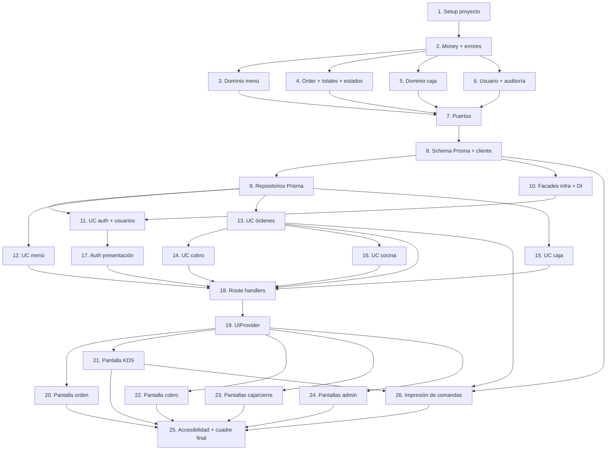

# Implementation Plan: Camarones Louisiana

## Overview

Las tareas se ejecutan de adentro hacia afuera (dominio puro primero, presentación al final), de forma incremental y verificable. El dominio crítico de dinero (caja, totales, estados) se prueba con tests por su sensibilidad. Cada tarea referencia los requisitos que satisface.

## Tasks

- [x] 1. Configurar el proyecto base Next.js + TypeScript + Prisma
  - Inicializar Next.js (App Router, TypeScript), Tailwind y shadcn/ui
  - Configurar Prisma con `DATABASE_URL` (pooled) y `DIRECT_URL` (directo) para Neon
  - Configurar Vitest para pruebas unitarias y de integración
  - Crear la estructura de carpetas `src/{domain,application,infrastructure,presentation}` según el diseño
  - _Requirements: ADR-004_

- [x] 2. Implementar el value object Money y errores de dominio
- [x] 2.1 Crear `Money` con aritmética exacta en centavos
  - Implementar `de`, `cero`, `suma`, `resta`, `multiplica`, `esCero`, `negativo`, `toDecimal`
  - Escribir pruebas unitarias de la aritmética (incluyendo redondeo y montos negativos)
  - _Requirements: 8.1, 8.5_
- [x] 2.2 Crear `DomainError` y el tipo `Result<T, E>` compartidos
  - _Requirements: 6.7_

- [x] 3. Implementar las entidades del dominio del menú
  - Crear `Category` y `MenuItem` (nombre, categoría, precio, foto, `stockDelDia`, `disponible`)
  - Implementar reglas de stock: `decrementar(cantidad)`, `incrementar(cantidad)`, auto-86 (`disponible=false` al llegar a 0), e impedir stock negativo
  - Escribir pruebas de conservación de stock y auto-86
  - _Requirements: 3.3, 3.4, 3.5, 5.2_
- [x] 4. Implementar la entidad Order y el cálculo de totales
- [x] 4.1 Crear `OrderChannel`, `OrderStatus`, `OrderItem` y `Order`
  - Modelar `OrderItem` con snapshot de `nombrePlato` y `precioUnit`
  - _Requirements: 4.1, 4.2, 4.3_
- [x] 4.2 Implementar `Order.recalcular()` (subtotal, envases por canal, envío, total)
  - Escribir pruebas de totales por canal (SALON sin envases, DELIVERY/RETIRAR con $0.50, envío solo DELIVERY)
  - _Requirements: 8.1, 8.2, 8.3, 8.4, 8.5_
- [x] 4.3 Implementar la máquina de estados `Order.transicionarA(estado, contexto)`
  - Definir la tabla de transiciones permitidas y la restricción de admin en cancelaciones
  - Escribir pruebas de transiciones válidas e inválidas y de estados terminales
  - _Requirements: 6.1, 6.2, 6.3, 6.4, 6.5, 6.6, 6.7, 6.8, 7.1_

- [x] 5. Implementar las entidades del dominio de caja
- [x] 5.1 Crear `Libro`, `TipoMovimiento`, `MovimientoCaja` y `CajaSession`
  - _Requirements: 11.7_
- [x] 5.2 Implementar el cálculo de cierre como funciones puras
  - `efectivoEsperado` (Σ libro EFECTIVO), `diferencia` (contado − esperado), `puente` (Σ PAGO_CARRERA passthrough)
  - Escribir pruebas con movimientos mezclados, incluyendo el caso passthrough
  - _Requirements: 13.1, 13.2, 13.3_

- [x] 6. Implementar las entidades de usuario y auditoría
  - Crear `Role`, `Permiso`, `User` (con `roles[]` y `puedeCobrar`) y `AuditEntry`
  - Implementar helpers de autorización del dominio (`tieneRol`, `puedeCobrar`, `esAdmin`)
  - _Requirements: 2.1, 2.3, 2.4, 16.1_

- [x] 7. Definir los puertos de la capa de aplicación
  - Crear las interfaces `OrderRepository`, `MenuRepository`, `CajaRepository`, `UserRepository`, `AuditRepository`
  - Crear los facades `AuthService`, `StorageService`, `RealtimeNotifier` y `Clock`
  - _Requirements: 1.1, 1.4, 9.3, 14.1_

- [x] 8. Implementar el esquema Prisma y el cliente
- [x] 8.1 Escribir `prisma/schema.prisma` con todos los modelos y enums del diseño
  - Generar la migración inicial usando `DIRECT_URL`
  - _Requirements: 3.1, 4.1, 8.1, 10.1, 11.7, 16.1_
- [x] 8.2 Crear el cliente Prisma singleton (seguro para serverless)
  - _Requirements: ADR-004_

- [x] 9. Implementar los repositorios Prisma
  - Implementar `PrismaOrderRepository`, `PrismaMenuRepository`, `PrismaCajaRepository`, `PrismaUserRepository`, `PrismaAuditRepository`
  - Mapear `Decimal` de Prisma a/desde `Money`
  - Implementar `ajustarStock` atómico y un patrón de unidad de trabajo (transacción) para operaciones de orden + stock + caja
  - _Requirements: 3.3, 5.2, 11.1, 11.2_

- [x] 10. Implementar los facades de infraestructura
- [x] 10.1 Implementar `JwtAuthService` (bcrypt/argon2 + JWT en cookie firmada)
  - _Requirements: 1.1, 1.2, 1.4_
- [x] 10.2 Implementar `S3StorageService` para comprobantes de transferencia
  - _Requirements: 9.3_
- [x] 10.3 Implementar `PollingNotifier` y `SystemClock`
  - _Requirements: 14.1_
- [x] 10.4 Crear el contenedor de inyección de dependencias `infrastructure/di/container.ts`
  - _Requirements: ADR-001_

- [x] 11. Implementar los casos de uso de autenticación y usuarios
- [x] 11.1 Implementar `Login` (busca por usuario, `verificarClave`, emite sesión)
  - Escribir pruebas de credenciales válidas, clave incorrecta y usuario inexistente con repos fake
  - _Requirements: 1.1, 1.2, 1.3_
- [x] 11.2 Implementar `GestionarUsuarios` (CRUD, asignar/revocar roles y `puedeCobrar`)
  - _Requirements: 2.1, 2.6_

- [x] 12. Implementar los casos de uso del menú
  - Implementar `GestionarMenu` (CRUD platos) y `AjustarStock` (set manual, forzar disponibilidad, reset diario)
  - _Requirements: 3.1, 3.2, 3.6, 3.7_

- [x] 13. Implementar los casos de uso de gestión de órdenes
- [x] 13.1 Implementar `CrearOrden` con validación por canal
  - Escribir pruebas: SALON sin mesa rechaza, DELIVERY sin dirección rechaza
  - _Requirements: 4.1, 4.2, 4.3, 4.4, 4.5_
- [x] 13.2 Implementar `AgregarItemAOrden` y `QuitarItem` (transaccional, con ajuste de stock y auto-86)
  - Validar estados permitidos (ABIERTA, EN_PREPARACION, ENTREGADA running tab)
  - Escribir pruebas de integración de stock y running tab con repos fake
  - _Requirements: 3.3, 3.4, 3.5, 5.1, 5.2, 5.5_
- [x] 13.3 Implementar `EnviarACocina`, `IniciarPreparacion`, `EntregarOrden`
  - Disparar `RealtimeNotifier.notificarCambio` en envío a cocina
  - _Requirements: 6.1, 6.2, 6.4_
- [x] 13.4 Implementar `CancelarOrden` con autorización admin, restauración de stock y auditoría
  - Escribir pruebas: no-admin cancelando orden enviada/cobrada es denegado; se crea `AuditEntry`
  - _Requirements: 6.8, 7.1, 7.2, 7.3, 16.1_

- [x] 14. Implementar el caso de uso de cobro
  - Implementar `CobrarOrden`: validar estado ENTREGADA y `puedeCobrar`, exigir comprobante en TRANSFERENCIA, generar movimientos según escenario y pasar a COBRADA, todo en una transacción
  - Escribir pruebas de los 4 escenarios de caja (efectivo, transferencia salón, delivery+transferencia passthrough, delivery+efectivo) y de idempotencia
  - Escribir pruebas de autorización: usuario sin `puedeCobrar` es denegado (2.3, 2.4)
  - _Requirements: 2.3, 2.4, 9.1, 9.2, 9.3, 11.1, 11.2, 12.1, 12.2, 12.3_

- [ ] 15. Implementar los casos de uso de caja
- [x] 15.1 Implementar `AbrirCaja` (rechaza si hay sesión abierta, crea movimiento APERTURA, solo admin)
  - _Requirements: 10.1, 10.2, 10.3, 10.4_
- [x] 15.2 Implementar `RegistrarPagoProveedor`, `RegistrarCompraMenor`, `IngresoRetiroManual`
  - _Requirements: 11.3, 11.4, 11.5, 11.6_
- [x] 15.3 Implementar `CerrarCaja` (calcula esperado/diferencia/puente, marca CERRADA, bloquea edición, solo admin, audita)
  - Escribir pruebas del cuadre completo y del bloqueo de edición tras cierre
  - _Requirements: 13.1, 13.2, 13.3, 13.4, 13.5, 13.6, 16.1_
- [x] 15.4 Implementar el cierre de órdenes `COBRADA` → `CERRADA` como parte del cierre del día
  - Hueco detectado en verificación (2026-07-10): la máquina de estados soporta la transición (tarea 4.3) pero ningún caso de uso la ejecuta; `CerrarCaja` no cierra las órdenes cobradas
  - Extender `CerrarCaja` (o crear `CerrarOrdenesDelDia`) para transicionar todas las órdenes `COBRADA` a `CERRADA` dentro de la misma transacción del cierre
  - Escribir pruebas: órdenes COBRADAs quedan CERRADAs tras el cierre; órdenes en otros estados no se tocan
  - _Requirements: 6.6_

- [x] 16. Implementar el caso de uso de cocina
  - Implementar `MarcarOrdenLista` (solo desde EN_PREPARACION, una sola cocina) con notificación realtime
  - _Requirements: 6.3, 15.1_

- [x] 17. Implementar la autenticación en presentación
- [x] 17.1 Crear `POST /api/auth/login` y el manejo de la cookie de sesión
  - _Requirements: 1.1, 1.2, 1.3_
- [x] 17.2 Crear `middleware.ts` con protección de rutas por rol/permiso
  - Implementar el mapa ruta → roles y la denegación con redirección a login
  - Nota: el middleware corre en Edge Runtime; `jsonwebtoken` (JwtAuthService) no es edge-compatible, así que la verificación de firma en el edge usa `jose` (`verifySessionEdge` en `infrastructure/auth/session.ts`), compartiendo `JWT_SECRET` y forma de payload con el login (runtime nodejs). Falta la pantalla `/login` (redirección destino) — se construye con las pantallas (Tarea 20+).
  - _Requirements: 1.5, 2.2, 2.5_

- [x] 18. Implementar los route handlers / server actions de cada dominio
  - Exponer endpoints/acciones para órdenes, menú, cobro, caja, cocina, usuarios y auditoría conectados a los casos de uso vía el contenedor DI
  - Crear `GET /api/orders/active` para el KDS
  - Exponer la consulta de auditoría (`AuditRepository.listar`) solo para admin (16.3, 16.4)
  - Mapear `DomainError`/`ForbiddenError`/`NotFoundError` a códigos HTTP (422/403/404)
  - Notas de implementación: capa HTTP compartida en `presentation/http/` (`apiError` mapea `DomainError.code`→status por convención de código, ya que no existen clases `ForbiddenError`/`NotFoundError`; `apiSession` con `requireSession`/`requireAdmin`/`cargarUsuarioDominio`; `serializers` entidad→DTO con `Money.toDecimal()`; `respond`/`orderTransition` reducen boilerplate). Los handlers revalidan admin (defensa en profundidad, Property 8) porque el mapa del middleware es por prefijo de página y no cubre `/api/*` con granularidad de rol. Comprobante de transferencia vía `multipart/form-data`. Falta: server actions no usadas (se optó por route handlers REST); pruebas E2E de handlers requieren DB (pendiente entorno).
  - _Requirements: 2.2, 2.6, 6.7, 14.1, 16.3, 16.4_

- [x] 19. Implementar el Proveedor_UI (confirmaciones y toasts accesibles)
  - Implementar `UIProvider` con `toast(text)` (región `aria-live="polite"`, auto-cierre ~2.6s) y `confirm({title, message, danger})` (modal `role="dialog"`, `aria-modal`, foco gestionado, cierre con Escape)
  - _Requirements: 17.1, 17.4, 17.5, 17.6_
  - **Implementación:** `src/presentation/components/ui/`:
    - `toastState.ts` — reducer puro (push/dismiss, ignora ids duplicados) + `TOAST_TTL_MS=2600` (R17.5). Aislado para test en Node.
    - `Toast.tsx` (`ToastRegion`) — región `aria-live="polite"`, `role="status"` por toast.
    - `Modal.tsx` — `role="dialog"` + `aria-modal`, etiquetado por título/mensaje, foco inicial en botón primario, `Escape`/backdrop cancelan, trampa de foco Tab/Shift+Tab, botones `min-h-[44px]` (objetivo táctil WCAG AA, R17.6), variante `danger` (R17.2).
    - `UIProvider.tsx` — context con `toast()` (temporizador de auto-cierre) y `confirm()→Promise<boolean>` (resuelve true/false); hook `useUI()`.
    - `index.ts` barrel. Montado global en `src/app/layout.tsx`.
  - **Tests:** `toastState.test.ts` (5) — apilado/orden/dedupe/dismiss selectivo/dismiss inexistente. Interacción DOM (foco, Escape, aria-live) queda cubierta por las pantallas 20–24 (falta jsdom/testing-library en el entorno; se difiere igual que los handlers E2E). tsc limpio, `next build` OK, 198 tests.

- [x] 20. Implementar la pantalla de toma de orden (Mesero/Operador)
  - Construir presenters puros (menú con disponibilidad, carrito, totales) y el container con wiring a casos de uso
  - Integrar toasts de agregar/quitar ítem y modal de enviar a cocina
  - Integrar la cancelación de orden con modal danger "Se cancelará y quedará en el historial de auditoría. ¿Continuar?" (17.2)
  - _Requirements: 4.1, 4.2, 4.3, 5.1, 5.3, 5.4, 17.2, 17.3_
  - **Contrato compartido:** `src/presentation/http/dto.ts` — tipos DTO derivados de los serializadores con `ReturnType<typeof toXDTO>` (única fuente de verdad, cliente y servidor mismo contrato).
  - **Cliente API:** `src/presentation/api/`:
    - `client.ts` — `apiFetch<T>` (JSON o FormData) + clase `ApiError {message, code, status}` que preserva el `code` del `DomainError`.
    - `orders.ts` — funciones tipadas: `listarMenu`, `crearOrden`, `agregarItem`, `quitarItem`, `enviarACocina`, `cancelarOrden`.
  - **Presenters puros** `src/presentation/components/presenters/order/`:
    - `orderTaking.ts` — view-model puro: builders de mensajes (R5.3/R5.4/R17.3, texto exacto R17.2), `validarDatosDeCanal` (espejo cliente R4.4/R4.5), banderas `puedeAgregarPlato`/`permiteEditarItems`/`puedeEnviarACocina`/`totalUnidades`.
    - `MenuGrid.tsx` — grid con disponibilidad/stock, deshabilita platos no agregables.
    - `Cart.tsx` — ítems, cantidades y totales (subtotal/envases/envío/total), botón quitar con `aria-label`.
    - `ChannelForm.tsx` — creación por canal (SALON→mesa, DELIVERY→dirección; R4.1–R4.3).
  - **Container:** `containers/OrderTakingContainer.tsx` — estado (menú/orden), wiring API + `useUI`: toasts agregar/quitar (refresca stock tras baja transaccional), modal envío (R17.3) + toast "Orden enviada a cocina", modal danger cancelar (R17.2). Errores → toast con `ApiError.message`.
  - **Página:** `src/app/orden/page.tsx`. Botones ≥44px (WCAG AA).
  - **Tests:** `orderTaking.test.ts` (10) — mensajes/pluralización, validación por canal, banderas derivadas. Presenters/container (DOM) se difieren (sin jsdom). tsc limpio, `next build` OK (`/orden` 4.32 kB), 208 tests.

- [x] 21. Implementar la pantalla KDS (cocina)
  - Construir la cola visual persistente con badges destacados para órdenes sin atender
  - Implementar `usePollingOrders` (3–5s, auto-reintento), `useAudioUnlock` (botón activar sonido) y `useWakeLock`
  - Integrar el modal de confirmación y toast de marcar lista
  - _Requirements: 14.1, 14.2, 14.3, 14.4, 14.5, 14.6, 15.2, 15.3_
  - **Cliente API:** `api/orders.ts` +`ordenesActivas(signal)`, `iniciarPreparacion`, `marcarLista`.
  - **View-model puro** `presenters/kds/kds.ts` — `INTERVALO_POLLING_MS=4000` (rango R14.1), `colaCocina` (filtra a ENVIADA_A_COCINA/EN_PREPARACION/LISTA, ordena sin-atender primero + número asc), `sinAtender`, `puedeIniciar`/`puedeMarcarLista`, mensajes exactos R15.2/R15.3. Testeable en Node.
  - **Hooks** `presentation/hooks/`:
    - `usePollingOrders` — polling en intervalo fijo, conserva cola previa y reintenta en el próximo tick ante fallo (R14.6), `AbortController` en cleanup.
    - `useAudioUnlock` — `activar` (gesto→`AudioContext.resume`, R14.4) + `reproducir` (beep oscilador); no-op hasta activarse.
    - `useWakeLock` — Screen Wake Lock, re-adquiere en `visibilitychange`, degrada sin soporte (R14.5).
  - **Presenters:** `KdsBoard` (cola visual persistente R14.2), `OrderCard` (badge "Nueva" destacado R14.3, acción por estado).
  - **Container:** `KdsContainer` — compone polling+wakelock+audio; beep al aparecer nueva orden sin atender; iniciar y marcar lista (modal R15.2 + toast R15.3). Banner "Reconectando…" ante error de polling.
  - **Página:** `src/app/kds/page.tsx`.
  - **Tests:** `kds.test.ts` (7) — cola (filtro/orden/prioridad), banderas, mensajes. Hooks/DOM diferidos (sin jsdom). tsc limpio, `next build` OK (`/kds` 3.84 kB), 215 tests.
  - **Nota entorno:** el shell reinicia con Node v16 (nvm default); vitest/next requieren ≥18. Ejecutar con `nvm use 22.12.0` antes de `vitest`/`next build`.

- [x] 22. Implementar la pantalla de cobro
  - Reutilizar el flujo de cobro: selección de método, subida de comprobante en transferencia, modal de confirmación y toast
  - Exponer la pestaña "Cobrar" para usuarios con `puedeCobrar`
  - _Requirements: 9.4, 9.5, 17.1_
  - **Sesión en cliente:** nuevo `GET /api/auth/session` → `{ user: SessionUserDTO | null }` (cookie es httpOnly; expone `puedeCobrar` para gatear UI, R2.3). Serializer `toSessionUserDTO` + tipo `SessionUserDTO`. Cliente `api/auth.ts::sesionActual`.
  - **Cliente API:** `api/orders.ts::cobrarOrden(id, metodo, comprobante?)` — EFECTIVO→JSON, TRANSFERENCIA→`FormData` con comprobante (R9.3).
  - **View-model puro** `presenters/cobro/cobro.ts` — `esCobrable`/`ordenesCobrables` (solo ENTREGADA, R9.2), `ETIQUETA_METODO`, `formatMoney`, mensajes exactos R9.4/R9.5, `puedeRegistrarCobro` (transferencia exige comprobante). Testeable en Node.
  - **Presenters:** `OrdenesCobrablesList` (selección), `CobroPanel` (método + subida comprobante + registrar).
  - **Container:** `CobroContainer` — reusa `usePollingOrders` filtrado a cobrables; revalida `puedeCobrar` (aviso si no); toast "Comprobante cargado" (R9.5), modal confirmación (R9.4) + toast "Cobro registrado · orden #N".
  - **Página:** `src/app/cobrar/page.tsx`.
  - **Tests:** `cobro.test.ts` (8) — cobrables, formato/mensajes, `puedeRegistrarCobro`. tsc limpio, `next build` OK (`/cobrar` 4.25 kB), 223 tests.

- [x] 23. Implementar las pantallas de caja y cierre (admin)
  - Construir apertura de caja, registro de movimientos y la pantalla de cierre legible (efectivo esperado/contado/diferencia y puente)
  - Integrar el modal de confirmación de cierre y toast
  - _Requirements: 10.1, 11.3, 11.4, 11.5, 11.6, 13.4, 13.7_
  - **Implementado:**
    - `GET /api/caja` (admin, read-only): estado de caja = sesión abierta (o `null`), movimientos y cuadre en vivo (`efectivoEsperado`/`puente` puros). Serializer `toEstadoCajaDTO`; tipo `EstadoCajaDTO`.
    - `POST /api/caja/cerrar` refactorizado a `toCierreResultadoDTO` (única fuente de verdad; ahora incluye `ordenesCerradas`). Tipo `CierreResultadoDTO`.
    - Cliente `api/caja.ts`: `estadoCaja`, `abrirCaja`, `registrarMovimiento`, `cerrarCaja` (+ tipo `TipoMovimientoManual`).
    - View-model puro `presenters/caja/caja.ts`: `hayCajaAbierta`, `formatMoney` (`$X.XX`, consistente con cobro), `etiquetaDiferencia`/`diferenciaEnVivo` (sobrante/faltante/cuadre con tolerancia FP), predicados `puedeAbrir`/`puedeRegistrarMovimiento`/`puedeCerrar`, mensajes apertura/movimiento/cierre. **Testeable Node** (`caja.test.ts`, 12 tests).
    - Presenters: `AperturaCaja` (fondo inicial), `MovimientosPanel` (form tipo/monto/nota + historial), `CierrePanel` (cuadre legible + diferencia en vivo `aria-live`).
    - `CajaContainer`: gatea admin (`sesionActual` → `Role.ADMIN`), fetch estado + refetch tras cada acción; apertura y cierre con modal de confirmación (`danger`) + toasts; toast de órdenes cerradas (R6.6). `app/caja/page.tsx`.
  - **Verificación:** 235 tests (+12), tsc limpio, `next build` OK — `/caja` (4.07 kB) + `/api/caja`.

- [x] 24. Implementar las pantallas de administración (menú, usuarios, auditoría)
  - Construir CRUD de menú/stock, gestión de usuarios/roles/permisos y consulta del registro de auditoría (solo admin)
  - _Requirements: 3.1, 3.2, 3.6, 2.6, 16.2, 16.3, 16.4_
  - **Implementado (solo presentación; los endpoints ya existían de la Tarea 18):**
    - Clientes: `api/menu.ts` (listar/crear/editar/eliminar/ajustarStock), `api/users.ts` (listar/crear + asignarRol/revocarRol/puedeCobrar/activar/desactivar), `api/audit.ts` (`listarAuditoria` con querystring de filtros).
    - View-models puros `presenters/admin/{menu,usuarios,auditoria}.ts`: validación de borradores, conversión draft↔payload, etiquetas de rol/acción, `alternarRol`, `resumenDetalle`, formato de fecha/moneda, mensajes de confirmación/toast. **Testeables Node** (26 tests: menu 10, usuarios 9, auditoria 7).
    - Hook `useAdminGuard` + presentacional `AdminGate` (carga/permiso/título) centralizan el gateado de UI admin (revalida `Role.ADMIN`, defensa en profundidad sobre el middleware).
    - Presenters: `PlatoForm`/`MenuAdminTable`, `UsuarioForm`/`UsuariosTable`, `AuditFiltroBar`/`AuditTable`.
    - Containers: `MenuAdminContainer` (crear/editar/eliminar con confirm, toggle disponibilidad, ajuste de stock inline), `UsuariosContainer` (crear, toggle rol asignar/revocar, toggle puedeCobrar, activar/desactivar con confirm), `AuditoriaContainer` (filtros + recarga).
    - Rutas `/admin` (índice), `/admin/menu`, `/admin/usuarios`, `/admin/auditoria`. Regla `/admin` → ADMIN añadida al middleware.
  - **Verificación:** 261 tests (+26), tsc limpio, `next build` OK — `/admin` (6.98 kB), `/admin/menu`, `/admin/usuarios`, `/admin/auditoria`.

- [x] 25. Verificación de accesibilidad y cuadre final
  - Auditar contraste, objetivos táctiles ≥44px y navegación por teclado en las pantallas principales
  - Ejecutar la suite de pruebas completa y verificar el build
  - _Requirements: 17.6_
  - **Auditoría y correcciones (WCAG 2.1 AA, R17.6):**
    - **Objetivos táctiles ≥44px:** auditados todos los `button`/`input`/`select`/`Link` de `presentation` y `app`. Todos cumplen `min-h-[44px]` (o `size-5` en checkboxes con label ≥44px). Sin hallazgos.
    - **Navegación por teclado:** sin `onClick` en elementos no interactivos (no hay trampas de teclado); controles nativos enfocables; Modal ya con focus-trap + Escape + `role="dialog"`/`aria-modal` (R17.4). **Añadido** anillo de foco visible global en `globals.css` con `:where(a,button,input,select,textarea,[tabindex]):focus-visible` (especificidad 0, usa token `--ring`) — antes `--ring` estaba definido pero sin usar.
    - **Contraste:** medidos los ratios de los tokens. `fg/bg` 19.9/19.1 y texto de botón `primary` 17.0 (excelentes). **Hallazgo:** `text-destructive`/`bg-destructive` fallaban AA — light 3.76 y **dark 2.00** (usado como texto en "No disponible"/"Agotado"/errores/"Eliminar"). **Corregido** `--destructive`: light `0 84.2% 60.2%→42%` (texto 6.05, botón 5.78) y dark `0 62.8% 30.6%→0 72% 55%` (texto 4.56, botón 4.19). Ambos roles ahora legibles.
  - **Verificación final:** tsc limpio, `next build` OK (lint + tipos, 23 páginas), **261 tests** en verde.

- [ ] 26. Implementar la impresión de comandas (R18)
- [ ] 26.1 Crear el dominio `PrintJob` (`PENDIENTE`/`IMPRESO`/`FALLIDO`, tipo `INICIAL`/`ADICION`/`REIMPRESION`, intentos máx. 3)
  - Implementar `confirmar()`, `registrarFallo()` (FALLIDO al 3er intento) y el snapshot de comanda como value object puro (en ADICION solo los ítems agregados)
  - Escribir pruebas de transiciones de estado del job y del límite de intentos
  - _Requirements: 18.3, 18.4_
- [ ] 26.2 Agregar el modelo `PrintJob` al esquema Prisma y el puerto `PrintJobRepository`
  - Índice único `(orderId, esInicial)` con `esInicial=true` solo en INICIAL (NULL en ADICION/REIMPRESION, los NULL no colisionan) para idempotencia; generar migración con `DIRECT_URL`
  - Implementar `PrismaPrintJobRepository` y registrarlo en el contenedor DI
  - _Requirements: 18.1, 18.8_
- [ ] 26.3 Implementar los casos de uso `EncolarComanda`, `ConfirmarImpresion` y `ReimprimirComanda`
  - Integrar `EncolarComanda` tipo INICIAL en `EnviarACocina` y tipo ADICION en `AgregarItemAOrden` (cuando la orden está en EN_PREPARACION/ENTREGADA, solo los ítems agregados), ambos de forma no bloqueante: un fallo al encolar no revierte la operación
  - Escribir pruebas: idempotencia del job inicial, adición genera job solo con ítems nuevos, no-bloqueo, reimpresión crea job REIMPRESION
  - _Requirements: 18.1, 18.6, 18.7, 18.8, 18.9_
- [ ] 26.4 Exponer los endpoints de la cola para el agente
  - `GET /api/print-jobs/pending` (FIFO) y `POST /api/print-jobs/{id}/confirm|fail`, autenticados con `PRINT_AGENT_TOKEN` (no sesión de usuario)
  - _Requirements: 18.2, 18.3, 18.4_
- [ ] 26.5 Implementar el `Agente_Impresion` local (`agent/`)
  - Proceso Node: polling 3–5s con token, render ESC/POS (`node-thermal-printer`, perfil EPSON) para 3nstar 80mm (48 columnas Font A), envío TCP 9100, confirmación/reporte de fallo, reconexión
  - Encabezado "ADICIÓN · orden #N" destacado en jobs de tipo ADICION
  - Config por env: `API_URL`, `PRINT_AGENT_TOKEN`, `PRINTER_HOST`, `PRINTER_PORT`
  - Documentar la instalación en la PC de cocina (misma máquina del KDS): arranque automático como servicio (nssm/Tarea Programada en Windows, systemd en Linux) e IP fija para la impresora
  - _Requirements: 18.2, 18.3, 18.4, 18.9_
- [ ] 26.6 Integrar la impresión en el KDS
  - Alerta visible de comanda no impresa (job `FALLIDO` o >60s `PENDIENTE`) y botón reimprimir con toast "Comanda enviada a impresión · orden #N"
  - _Requirements: 18.5, 18.6_

## Task Dependency Graph

```json
{
  "waves": [
    { "wave": 1, "tasks": ["1"] },
    { "wave": 2, "tasks": ["2"] },
    { "wave": 3, "tasks": ["3", "4", "5", "6"] },
    { "wave": 4, "tasks": ["7"] },
    { "wave": 5, "tasks": ["8"] },
    { "wave": 6, "tasks": ["9", "10"] },
    { "wave": 7, "tasks": ["11", "12", "13", "15"] },
    { "wave": 8, "tasks": ["14", "16"] },
    { "wave": 9, "tasks": ["17", "18"] },
    { "wave": 10, "tasks": ["19"] },
    { "wave": 11, "tasks": ["20", "21", "22", "23", "24", "26"] },
    { "wave": 12, "tasks": ["25"] }
  ]
}
```



## Notes

- **Verificación 2026-07-10**: todas las tareas marcadas `[x]` (1–13, 15.1–15.3) fueron verificadas contra el código: 165/165 tests pasan, `tsc --noEmit` limpio, dominio/casos de uso/infra cumplen los requisitos referenciados. Cambios de esta verificación: se agregó 15.4 (hueco R6.6: nadie cierra órdenes COBRADAs), se sumaron 2.3/2.4 a la tarea 14, auditoría/usuarios a la tarea 18, y el modal de cancelación (17.2) a la tarea 20.
- El núcleo de dinero (tareas 2, 4, 5, 14, 15) lleva pruebas obligatorias por su sensibilidad; el resto se prueba donde aporta valor.
- Los facades (Auth, Storage, Realtime) aíslan los SDKs: cambiar a WebSocket, OCR o Cognito no debe tocar el dominio ni los casos de uso.
- Toda operación que toca orden + stock + caja a la vez corre en transacción Prisma (ver tareas 9, 13.2, 14).
- Las asunciones pendientes (multi-rol, reset diario de stock, no split, impresora 3nstar 80mm ESC/POS única, hardware del agente por confirmar) están reflejadas en el diseño; confirmar antes de la tarea correspondiente si cambian.
- **Impresión (R18, tarea 26)**: el backend serverless no alcanza la impresora de la LAN; la entrega es vía cola `PrintJob` en DB + `Agente_Impresion` local que hace polling (ver design.md §Impresión de comandas). La impresión nunca bloquea la operación de negocio. Ítems agregados a una orden ya en cocina imprimen ticket "ADICIÓN" con solo los ítems nuevos — nunca la comanda completa.
