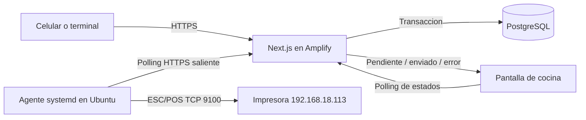

# Plan de implementacion: cola de impresion y agente Ubuntu

## 1. Objetivo

Permitir que una orden creada desde cualquier red se guarde en la aplicacion desplegada en AWS Amplify y se imprima de forma confiable en la impresora LAN del restaurante (`192.168.18.113:9100`) mediante un agente ligero ejecutado en la computadora Ubuntu de cocina.

El navegador de cocina seguira consultando y mostrando ordenes, pero no sera responsable de imprimir. La impresion debe continuar aunque el navegador se cierre, el usuario cierre sesion o el proceso local se reinicie.

## 2. Decisiones de arquitectura



- Amplify aloja la interfaz y las API, pero nunca intenta conectarse a la IP privada de la impresora.
- PostgreSQL es la fuente de verdad para la cola.
- El agente Ubuntu inicia automaticamente con `systemd`, reclama un trabajo por vez y reporta el resultado.
- La cola usa leases y claves de deduplicacion. No se usa solamente `Orden.impresa` para coordinar reintentos.
- El payload imprimible se guarda como snapshot JSON en el momento de crear el trabajo. Una modificacion posterior no cambia silenciosamente una comanda que ya estaba en cola.
- La confirmacion `SUCCEEDED` significa que el envio TCP/ESC-POS termino sin error. No demuestra fisicamente que salio papel; esa limitacion debe mostrarse como "enviada a impresora", no como prueba fisica absoluta.

## 3. Politica de los cinco minutos

La regla propuesta se implementara como una ventana de impresion automatica configurable, no como eliminacion de trabajos:

- `PRINT_AUTO_WINDOW_MINUTES=5`.
- Un trabajo pendiente dentro de la ventana puede reclamarse automaticamente.
- Un trabajo que supere la ventana pasa a `NEEDS_REVIEW`.
- Cocina muestra una alerta y permite `Imprimir ahora` o `Descartar` con usuario, fecha y razon auditados.
- Las ordenes existentes antes de `PRINT_CUTOVER_AT` no generan trabajos automaticamente.

Consecuencia deliberada: una caida menor de cinco minutos se recupera sola. Una caida mayor no imprime comandas antiguas inesperadamente; requiere confirmacion. Si el negocio prefiere recuperacion totalmente automatica, la ventana puede ampliarse o desactivarse sin cambiar el modelo.

## 4. Modelo de datos

Agregar enums Prisma:

```prisma
enum PrintJobType {
  ORDER
  AMENDMENT
  REPRINT
}

enum PrintJobStatus {
  PENDING
  PROCESSING
  RETRY
  SUCCEEDED
  NEEDS_REVIEW
  DISCARDED
  FAILED
}
```

Agregar `PrintJob`:

```prisma
model PrintJob {
  id             String         @id @default(cuid())
  ordenId        String
  orden          Orden          @relation(fields: [ordenId], references: [id], onDelete: Cascade)
  type           PrintJobType
  status         PrintJobStatus @default(PENDING)
  dedupeKey      String         @unique
  revision       Int
  payloadVersion Int            @default(1)
  payload        Json
  attempts       Int            @default(0)
  maxAttempts    Int            @default(10)
  availableAt    DateTime       @default(now())
  autoPrintUntil DateTime
  workerId       String?
  leasedAt       DateTime?
  leaseExpiresAt DateTime?
  lastErrorCode  String?
  lastError      String?
  printedAt      DateTime?
  reviewedAt     DateTime?
  reviewedBy     String?
  reviewReason   String?
  createdAt      DateTime       @default(now())
  updatedAt      DateTime       @updatedAt

  @@index([status, availableAt])
  @@index([ordenId, createdAt])
  @@index([leaseExpiresAt])
}
```

Cambios en `Orden`:

- Agregar `printRevision Int @default(0)`.
- Agregar relacion `printJobs PrintJob[]`.
- Conservar temporalmente `impresa` por compatibilidad. Solo pasa a `true` cuando el trabajo inicial `ORDER` termina correctamente.
- No usar `impresa=false` como mecanismo para reclamar trabajos.

Agregar opcionalmente `PrintAgent` para observabilidad:

- `id`, `name`, `version`, `lastSeenAt`, `lastPrinterCheckAt`, `printerReachable`, `lastError`.
- Permite alertar si Ubuntu lleva mas de 60-90 segundos sin reportarse.

## 5. Creacion atomica de trabajos

Crear un servicio de dominio, por ejemplo `lib/print-jobs.ts`, con funciones reutilizables:

- `buildOrderPrintPayload(orden)`.
- `buildAmendmentPrintPayload(orden, cambios)`.
- `enqueueOrderPrintJob(tx, orden, type, revision)`.
- `buildDedupeKey(ordenId, type, revision)`.

Reglas:

1. Orden nueva con stock: crear orden, descontar stock, registrar historial y crear `PrintJob(ORDER)` en una sola transaccion.
2. Orden pendiente de stock: no crear trabajo todavia.
3. Aprobacion administrativa: cambiar a `pendiente`, descontar stock, registrar historial y crear `PrintJob(ORDER)` en la misma transaccion.
4. Modificacion: actualizar items, stock, total, historial, incrementar `printRevision` y crear `PrintJob(AMENDMENT)` en una unica transaccion.
5. Reimpresion manual: crear `PrintJob(REPRINT)` con una nueva revision/dedupe key y registrar quien la solicito.
6. Nunca ejecutar `PrinterService` desde una ruta alojada en Amplify.

La ruta de modificacion actual realiza varias operaciones separadas. Debe refactorizarse para evitar que items, total, historial y trabajo de impresion queden parcialmente actualizados.

## 6. API privada del agente

Crear rutas Node.js, no Edge:

- `POST /api/print-agent/claim`
  - Autentica el agente.
  - Recupera leases vencidos.
  - Mueve trabajos caducados a `NEEDS_REVIEW`.
  - Reclama atomicamente un trabajo elegible con `FOR UPDATE SKIP LOCKED`.
  - Incrementa `attempts`, asigna `workerId` y un lease corto.
- `POST /api/print-agent/jobs/[id]/complete`
  - Solo acepta al propietario del lease.
  - Marca `SUCCEEDED`, guarda `printedAt` y actualiza `Orden.impresa` si corresponde.
- `POST /api/print-agent/jobs/[id]/fail`
  - Guarda codigo/mensaje sanitizado.
  - Programa `RETRY` con backoff o pasa a `FAILED` al agotar intentos.
- `POST /api/print-agent/heartbeat`
  - Registra version, salud del agente y alcance de la impresora.
- `GET /api/print-jobs`
  - Solo usuarios autorizados; alimenta estados y alertas en cocina/admin.
- `POST /api/print-jobs/[id]/requeue` y `/discard`
  - Requieren usuario autorizado y dejan auditoria.
- `POST /api/ordenes/[id]/reprint`
  - Crea un trabajo nuevo; no modifica uno finalizado.

El claim debe ser atomico incluso si accidentalmente se ejecutan dos agentes. La respuesta de `complete` y `fail` debe ser idempotente.

## 7. Seguridad requerida antes de publicar

La autenticacion actual en `localStorage` solo protege la navegacion visual; las API no tienen una sesion confiable. Antes de exponer Amplify:

- Hashear contrasenas con bcrypt/argon2.
- Crear sesion firmada en cookie `HttpOnly`, `Secure`, `SameSite`.
- Verificar sesion y rol en cada API sensible.
- No confiar en `adminId`, nombre o rol enviados por el navegador.
- Proteger la API del agente con un secreto independiente de alta entropia o credenciales rotables.
- Guardar un hash del token o compararlo en tiempo constante; nunca registrarlo en logs.
- Limitar cuerpo, validar esquemas de entrada y aplicar rate limiting a login y endpoints publicos.
- El agente solo realiza conexiones HTTPS salientes; no se abren puertos de entrada en el router.

## 8. Agente de impresion Ubuntu

Crear un paquete independiente y ligero:

```text
print-agent/
  package.json
  tsconfig.json
  src/config.ts
  src/api-client.ts
  src/printer.ts
  src/worker.ts
  src/health.ts
  systemd/restaurant-print-agent.service
  scripts/install-ubuntu.sh
```

Responsabilidades:

- Validar variables al iniciar: `API_BASE_URL`, `PRINT_AGENT_TOKEN`, `WORKER_ID`, `PRINTER_IP`, `PRINTER_PORT`.
- Consultar cada 2-5 segundos con un solo request pendiente.
- Procesar secuencialmente para conservar el orden de comandas.
- Enviar ESC/POS con timeout y clasificar errores (`EHOSTUNREACH`, `ECONNREFUSED`, timeout, payload invalido).
- Reportar exito/error y no borrar nunca un trabajo localmente.
- Usar backoff con jitter cuando Amplify o Internet no respondan.
- Emitir heartbeat cada 30 segundos.
- Manejar `SIGTERM` para terminar el trabajo actual o dejar que venza el lease.
- Escribir logs estructurados sin secretos; `journald` conserva el historial operativo.

Servicio `systemd`:

- Usuario del sistema dedicado, sin privilegios administrativos.
- `After=network-online.target` y `Wants=network-online.target`.
- `Restart=on-failure` y `RestartSec=5`.
- Inicio automatico con `systemctl enable --now`.
- Variables en `/etc/restaurant-print-agent.env` con permisos restringidos.
- La computadora debe tener suspension automatica desactivada.

Antes de instalar, confirmar `cat /etc/os-release`, `uname -m`, memoria, Node compatible y conectividad a `192.168.18.113:9100`. Ubuntu 19/21 debe actualizarse a una LTS soportada si el hardware lo permite.

## 9. Interfaz de cocina y administracion

El polling actual de ordenes se conserva para la lista. Se agregan consultas de estado de impresion:

- Indicador global del agente: `En linea`, `Sin conexion`, `Impresora no alcanzable`.
- Estado por orden: `En cola`, `Imprimiendo`, `Enviada`, `Reintentando`, `Requiere revision`, `Error`.
- Conteo de pendientes y errores en el encabezado.
- Acciones autorizadas: reintentar, imprimir orden antigua, descartar y reimprimir.
- Mostrar intento, ultima fecha y error comprensible; no mostrar stack traces.
- Polling es la fuente de recuperacion. SSE puede mejorar inmediatez, pero no se considera garantia de entrega en Amplify.

## 10. Ajustes de Amplify

El repositorio usa Next.js 16, mientras el soporte administrado documentado de Amplify llega a Next.js 15. Antes del despliegue:

- Bajar y validar el proyecto con una version estable de Next.js 15, o cambiar de plataforma/adaptador mediante una decision explicita.
- Fijar Node.js 20 o 22 tanto en desarrollo como en Amplify.
- Cambiar `npm install` por `npm ci`.
- Cambiar `prisma db push` por `prisma migrate deploy`.
- Eliminar `PRINTER_IP` y `PRINTER_PORT` de Amplify; pertenecen exclusivamente al agente Ubuntu.
- Configurar `DATABASE_URL`, secreto de sesion y credencial del agente como secretos de entorno.
- Verificar logs de API en CloudWatch.
- Ejecutar una migracion de staging antes de produccion.

## 11. Estrategia de reintentos y consistencia

- Lease sugerido: 30 segundos, renovable si una operacion pudiera durar mas.
- Backoff sugerido: 5 s, 15 s, 30 s, 60 s y luego intervalos limitados.
- Maximo inicial: 10 intentos; despues `FAILED` y alerta visible.
- `dedupeKey` impide crear dos trabajos para el mismo evento logico.
- El claim atomico impide que dos agentes procesen simultaneamente el mismo trabajo.
- Si el agente se cae antes de enviar, el lease vence y se reintenta.
- Si imprime y se cae antes de confirmar, puede existir una duplicacion. ESC/POS TCP no ofrece exactamente-una-vez fisico; el numero corto de orden, revision y tipo deben imprimirse claramente para reconocerla.
- Una reimpresion siempre indica `REIMPRESION`, usuario y hora.
- Una modificacion imprime solamente el delta y la razon, identificada como `MODIFICACION`, para evitar preparar dos veces la orden completa.

## 12. Pruebas

### Unitarias

- Construccion de payload inicial, modificacion y reimpresion.
- Dedupe keys y revisiones.
- Transiciones validas/invalidas de estado.
- Ventana de cinco minutos y `NEEDS_REVIEW`.
- Backoff, clasificacion de errores y sanitizacion.
- Autorizacion por rol y autenticacion del agente.

### Integracion con PostgreSQL

- Orden y trabajo se confirman o revierten juntos.
- Aprobacion genera exactamente un trabajo.
- Modificacion genera snapshot correcto y una sola revision.
- Dos claims concurrentes no reciben el mismo trabajo.
- Lease vencido vuelve a ser reclamable.
- `complete`/`fail` repetidos son idempotentes.
- Los registros anteriores al cutover no se imprimen.

### Agente

- Servidor TCP falso valida bytes, corte y contenido ESC/POS.
- Impresora apagada, IP incorrecta, timeout e Internet intermitente.
- Reinicio del proceso durante un trabajo.
- Reinicio completo de Ubuntu y arranque automatico.

### Fin a fin en restaurante

- Orden desde celular en datos moviles.
- Orden normal, orden aprobada sin stock y modificacion.
- Estado visible desde que se encola hasta que se envia.
- Caida menor de cinco minutos y recuperacion automatica.
- Caida mayor de cinco minutos y revision manual.
- Reimpresion auditada.

## 13. Despliegue gradual

1. **Preparacion:** confirmar Ubuntu, fijar politica de antiguedad y crear ambiente de staging.
2. **Base de datos:** desplegar enums/modelos e indices sin cambiar aun el flujo existente.
3. **Cola en sombra:** crear trabajos con una feature flag, pero el agente solo registra (`DRY_RUN=true`).
4. **Validacion:** comparar ordenes con trabajos y comprobar deduplicacion/estados.
5. **Agente piloto:** instalar `systemd`, probar impresora real y heartbeat.
6. **Cutover:** definir `PRINT_CUTOVER_AT`, desactivar impresion directa y activar consumo real. Nunca dejar ambos mecanismos activos simultaneamente.
7. **Amplify:** desplegar version soportada, migraciones y seguridad; probar desde una red externa.
8. **Observacion:** revisar durante un turno completo pendientes, errores, duplicados y tiempos.
9. **Limpieza:** retirar el codigo de impresion directa del servidor y documentar operacion/recuperacion.

## 14. Criterios de aceptacion

- Una orden y su trabajo se guardan atomicamente.
- Con agente e impresora disponibles, una orden aparece enviada en menos de 10 segundos.
- Cerrar el navegador de cocina no detiene la impresion.
- Reiniciar Ubuntu reactiva el agente sin intervencion manual.
- Dos agentes no imprimen simultaneamente el mismo trabajo.
- Una orden de mas de cinco minutos no se pierde y requiere una decision visible.
- Los errores de impresora son visibles y reintentables sin perder la orden.
- Aprobaciones, modificaciones y reimpresiones producen el tipo correcto de ticket.
- Las ordenes anteriores al cutover no se imprimen automaticamente.
- Ninguna ruta publica confia en el rol o identidad enviados por el cliente.
- Amplify no contiene ni intenta usar la IP privada de la impresora.

## 15. Orden recomendado de implementacion

1. Compatibilidad Next.js/Amplify y autenticacion del servidor.
2. Migracion `PrintJob`/`PrintAgent` y servicio de dominio.
3. Refactor de creacion, aprobacion y modificaciones para encolar atomicamente.
4. API privada de claim/complete/fail/heartbeat.
5. Agente Ubuntu y adaptador ESC/POS.
6. Estados y controles en cocina/admin.
7. Pruebas automatizadas y servidor TCP falso.
8. Staging, dry run, instalacion systemd y cutover.

No se debe empezar por hacer que el componente React imprima: eso mantendria la dependencia del navegador y no resolveria la recuperacion ante caidas.
