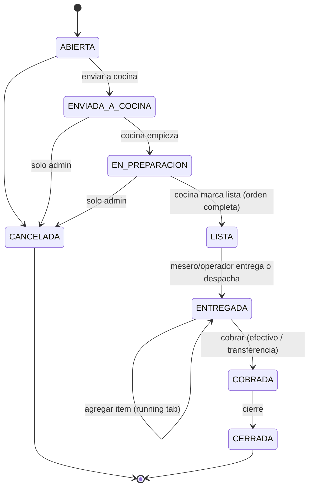

# Sistema de Gestión de Órdenes — Camarones Louisiana
## Master Prompt / Especificación Técnica — v2

> **Cambios v2:** el rol `mesero` puede **cobrar** (permiso asignable, ver §4) · convenciones de UX para confirmaciones y toasts (§10b) · sección de **skills/approaches para el build** (§13).

> **Cómo usar este documento:** esta es la especificación maestra para alimentar a un agente de código (Claude Code, Cursor) o para guiar el desarrollo manual. Codifica dominio, requisitos, arquitectura y restricciones. Está escrita en español con terminología técnica en inglés (estándar de la industria).

---

## 1. Contexto del negocio

Restaurante de mariscos **single-tenant** (un solo negocio, sin multi-tenant) en Cuenca, Ecuador. Escala chica: ~5 mesas, 3 usuarios operativos + 1 admin, 10–15 órdenes/día. Hoy el proceso es manual; el objetivo es digitalizar la **toma de orden**, el **flujo de cocina** y el **cuadre de caja**, reduciendo errores de comunicación y de dinero.

---

## 2. Stack tecnológico (fijo)

| Capa | Tecnología | Notas |
|------|-----------|-------|
| App (front + back) | **Next.js** (App Router, TypeScript) | **Modular monolith**, NO microservicios |
| UI | React + Tailwind + shadcn/ui | |
| ORM | **Prisma** | |
| DB | **PostgreSQL serverless en Neon** | `DATABASE_URL` = string **pooled** (`-pooler`, PgBouncer); `DIRECT_URL` = conexión directa solo para migraciones |
| Hosting | **AWS Amplify Hosting** | SSR corre en Lambda |
| Object storage | **AWS S3** | Comprobantes de transferencia + **Lifecycle Rule** de auto-borrado a N días |
| Real-time | **Polling** desde el cliente a route handlers de Next | Detrás del facade `RealtimeNotifier` |
| Auth | Credenciales propias: **bcrypt/argon2** + login por **POST** + sesión por **JWT/cookie firmada** | NO Cognito. Detrás del facade `AuthService`. Sugerido: Auth.js (NextAuth) credentials provider |

---

## 3. Arquitectura

**Clean Architecture + SOLID.** La regla de dependencia apunta hacia adentro: `presentation → application → domain`. El dominio no conoce ningún framework ni SDK.

### Capas

- **domain** — entidades, value objects y reglas de negocio puras. Sin imports de Next, Prisma, AWS. Ej: `Order`, `OrderItem`, `OrderStatus`, `MenuItem`, `CajaSession`, `MovimientoCaja`, `User`, `Role`.
- **application (use cases)** — orquestación del negocio. Define **puertos** (interfaces) que la infraestructura implementa: repositorios, `AuthService`, `StorageService`, `RealtimeNotifier`, `Clock`. Ej de use cases: `CrearOrden`, `AgregarItemAOrden`, `EnviarACocina`, `MarcarOrdenLista`, `CobrarOrden`, `RegistrarPagoCarrera`, `AbrirCaja`, `CerrarCaja`.
- **infrastructure** — implementaciones concretas: repositorios Prisma, `S3StorageService`, `JwtAuthService`, `PollingNotifier`. Aquí viven los **Facades** sobre los SDKs.
- **presentation (Next.js)** — route handlers / server actions como entrada, y UI con **Container/Presenter**.

### Patrón Container/Presenter

- **Presenters**: componentes de UI puros. Reciben props, renderizan, emiten callbacks. Cero fetching, cero lógica de negocio. Fáciles de testear y de previsualizar.
- **Containers**: conectan use cases / data a los presenters vía hooks y estado. Hacen el fetching (polling), manejan loading/error, y pasan datos listos al presenter.

### Patrón Facade

Cada SDK o servicio externo se esconde detrás de una interfaz definida en `application/ports` e implementada en `infrastructure`. El dominio y los use cases nunca importan `@aws-sdk/*`, `bcrypt`, etc. directamente. Esto deja **SRI, OCR, WebSocket o Cognito** como sustituciones futuras sin tocar el core.

### Estructura de carpetas (propuesta)

```
src/
  domain/
    order/        Order.ts, OrderItem.ts, OrderStatus.ts, OrderChannel.ts
    menu/         MenuItem.ts, Category.ts
    caja/         CajaSession.ts, MovimientoCaja.ts, TipoMovimiento.ts, Libro.ts
    user/         User.ts, Role.ts
  application/
    ports/        OrderRepository.ts, MenuRepository.ts, CajaRepository.ts,
                  UserRepository.ts, AuthService.ts, StorageService.ts,
                  RealtimeNotifier.ts, Clock.ts
    use-cases/
      orders/     CrearOrden.ts, AgregarItemAOrden.ts, QuitarItem.ts,
                  EnviarACocina.ts, MarcarOrdenLista.ts, EntregarOrden.ts,
                  CobrarOrden.ts, CancelarOrden.ts
      caja/       AbrirCaja.ts, RegistrarPagoCarrera.ts, RegistrarPagoProveedor.ts,
                  RegistrarCompraMenor.ts, IngresoRetiroManual.ts, CerrarCaja.ts
      menu/       GestionarMenu.ts, AjustarStock.ts
      auth/       Login.ts
  infrastructure/
    db/           prisma client, repositories/ (PrismaOrderRepository.ts, ...)
    storage/      S3StorageService.ts
    auth/         JwtAuthService.ts
    realtime/     PollingNotifier.ts
  presentation/
    app/          (Next.js routes + route handlers / server actions)
    components/
      presenters/ (UI pura)
      containers/ (wiring a use cases)
    hooks/        (usePollingOrders, etc.)
prisma/
  schema.prisma
```

---

## 4. Roles y permisos

Usuarios del sistema: **mesero**, **cocina**, **operador** (WhatsApp), **admin**. El **delivery NO es usuario** (servicio externo, sin acceso). Un usuario **puede tener varios roles** (equipo chico). *(Asunción — confirmar.)*

| Acción | mesero | cocina | operador | admin |
|--------|:------:|:------:|:--------:|:-----:|
| Crear orden (salón / delivery / retirar) | ✅ | — | ✅ | ✅ |
| Agregar / quitar ítems | ✅ | — | ✅ | ✅ |
| Marcar orden LISTA | — | ✅ | — | ✅ |
| Marcar entregada / despachar | ✅ | — | ✅ | ✅ |
| Registrar carrera al despachar | ✅ | — | ✅ | ✅ |
| Cobrar orden (efectivo/transferencia) | ✅ | — | ✅ | ✅ |
| **Cancelar orden ya enviada/cobrada** | — | — | — | ✅ (sensible) |
| **Descuentos / cortesías / override de precio** | — | — | — | ✅ (sensible) |
| **Abrir/cerrar caja, ajustes de efectivo** | — | — | — | ✅ (sensible) |
| Registrar pago a proveedor / compra menor | — | — | — | ✅ |
| Gestionar menú, precios, stock, disponibilidad | — | — | — | ✅ |
| Gestionar usuarios y roles | — | — | — | ✅ |
| Ver reportes e historial | — | — | — | ✅ |
| Ver **audit log** (quién hizo qué) | — | — | — | ✅ |

Las acciones marcadas **(sensible)** son por donde se fuga el dinero; deben ser solo-admin y **siempre** generar un registro en el audit log (quién, qué, cuándo).

> **Mesero cobra (v2).** Mientras no exista un rol cajero dedicado, `mesero` y `operador` tienen el permiso **`cobrar`**. Clave: esto se modela como un **permiso asignable**, no cableado. El día que entre un cajero, se le revoca el permiso al mesero desde gestión de usuarios — cero cambios de código. En la UI, el rol mesero expone una pestaña "Cobrar" junto a "Nueva orden" que reutiliza exactamente el mismo flujo de cobro de Caja.

---

## 5. Menú y disponibilidad

- `MenuItem`: nombre, categoría, precio, foto (URL S3), `stockDelDia` (int), `disponible` (bool).
- **Auto-decrement:** al confirmar/agregar ítems a una orden, decrementar `stockDelDia` por cantidad pedida. Al llegar a 0 → `disponible = false` automáticamente (**auto-86**), así el mesero/operador no puede seguir vendiéndolo.
- El admin define el stock cada mañana, puede resetearlo y forzar `disponible`/agotado a mano. *(Asunción: el stock se resetea diariamente — confirmar.)*

---

## 6. Ciclo de vida de la orden (state machine)

**Estados:** `ABIERTA → ENVIADA_A_COCINA → EN_PREPARACION → LISTA → ENTREGADA → COBRADA → CERRADA`, más `CANCELADA`.

**Canales:** `SALON` (con número de mesa), `DELIVERY` (con datos/dirección del cliente), `RETIRAR` (cliente recoge).



**Reglas:**
- Ítems se pueden **agregar/quitar** mientras la orden esté `ABIERTA` o `EN_PREPARACION` (ajustando stock).
- Agregar ítems **después de ENTREGADA** = *running tab*: la misma orden sigue abierta y acumula hasta `COBRADA` (un solo cobro final).
- **Recargo de envases ($0.50)** aplica a `DELIVERY` y `RETIRAR` (no a `SALON`).
- Cocina marca **LISTA por orden completa** (una sola cocina, sin estaciones).
- Cancelar una orden ya enviada/cobrada requiere **admin** y queda en el audit log.

---

## 7. Pagos

- Métodos: **EFECTIVO** y **TRANSFERENCIA**. (Sin tarjeta — fuera de alcance v1.)
- **Transferencia:** subir screenshot del comprobante → S3 (vía `StorageService`), **validación manual** por cajero/admin. (Sin OCR en v1.)
- Estructura de montos por orden:
  - `subtotal` = suma de ítems
  - `envases` = $0.50 si canal es DELIVERY o RETIRAR
  - `envio` (carrera) = valor variable, solo en DELIVERY
  - `total` = subtotal + envases + envio
- Pago dividido (split): **fuera de alcance v1.** *(Asunción — confirmar.)*

---

## 8. Modelo de caja (el núcleo)

Diseño: **por debajo, libro mayor completo y auditable; arriba, cierre de leer en 30 segundos.**

### Concepto: un fondo físico, dos libros

La caja es **un solo fondo físico**, pero el dinero se contabiliza en dos **libros**: `EFECTIVO` (lo del cajón) y `TRANSFERENCIA` (el banco). Cada pago de orden cae en uno. Todo evento de plata es un `MovimientoCaja`.

### Entidades

- `CajaSession`: `fecha`, `fondoInicial`, `estado` (ABIERTA | CERRADA), `efectivoContado`, `diferencia`, `firmadoPor`.
- `MovimientoCaja`: `tipo`, `libro` (EFECTIVO | TRANSFERENCIA), `monto` (con signo), `orderId?`, `categoria?`, `esCarreraPassthrough` (bool), `empleado`, `timestamp`, `nota`.

### Tipos de movimiento

`APERTURA` (+, EFECTIVO) · `VENTA_EFECTIVO` (+, EFECTIVO) · `VENTA_TRANSFERENCIA` (+, TRANSFERENCIA) · `PAGO_CARRERA` (−, EFECTIVO) · `PAGO_PROVEEDOR` (−, EFECTIVO) · `COMPRA_MENOR` (−, EFECTIVO) · `INGRESO_MANUAL` (+, EFECTIVO) · `RETIRO_MANUAL` (−, EFECTIVO) · `CIERRE`.

### Reglas por escenario

| Escenario | Movimientos generados |
|-----------|----------------------|
| Venta en efectivo (salón/retirar/delivery cash) | `VENTA_EFECTIVO +total_en_efectivo` |
| Venta por transferencia (salón/retirar) | `VENTA_TRANSFERENCIA +total` |
| **Delivery por transferencia** | `VENTA_TRANSFERENCIA +(comida+envases+envio)` **y** `PAGO_CARRERA −envio` (EFECTIVO, `esCarreraPassthrough=true`), registrado al despachar |
| **Delivery en efectivo** | `VENTA_EFECTIVO +(comida+envases)` — el motorizado te paga la comida; **la carrera nunca toca la caja** (la cobra el motorizado directo al cliente) |
| Pago a proveedor / compra menor | `PAGO_PROVEEDOR` / `COMPRA_MENOR −monto` (EFECTIVO) |

### Ejemplo trabajado (tu caso real)

```
Pedido #X — DELIVERY — TRANSFERENCIA
  Comida ............ 10.00
  Envases ...........  0.50
  Envío (carrera) ...  2.00
  Total ............. 12.50    → el cliente transfiere 12.50 al banco

Movimientos:
  VENTA_TRANSFERENCIA   +12.50  (libro TRANSFERENCIA)
       └─ ingreso real del negocio: 10.50 (comida + envases)
       └─ passthrough (carrera): 2.00
  PAGO_CARRERA           −2.00  (libro EFECTIVO, esCarreraPassthrough=true)
       └─ registrado por el empleado al despachar la orden

En el cierre del día:
  • La caja queda −2.00 por esta orden.
  • PUENTE: "Repón $2.00 del banco a la caja" (el cliente ya te pagó esos $2 al banco).
  • Ingreso real del negocio: 10.50. La carrera netea a 0 (entra al banco, sale de la caja).
```

### Pantalla de cierre (simple)

```
EFECTIVO (físico)
  Fondo inicial              + 50.00
  Ventas en efectivo         + XX.XX
  − Carreras pagadas         −  X.XX
  − Pagos a proveedores      −  X.XX
  − Compras menores          −  X.XX
  ───────────────────────────────────
  Efectivo esperado          =  XX.XX
  Efectivo contado (físico)  [ input del cajero ]
  Diferencia                 =   X.XX     ✅ verde si 0 / ⚠️ si no

TRANSFERENCIAS (banco)
  Ventas por transferencia   + XX.XX

PUENTE
  ⮕ De las carreras, $X.XX salieron de caja pero son de pedidos
    pagados por transferencia. Repón $X.XX del banco a la caja.
```

`efectivoEsperado = Σ(movimientos del libro EFECTIVO)`. `diferencia = contado − esperado`. `puente = Σ(PAGO_CARRERA con esCarreraPassthrough=true del día)`.

---

## 9. Autenticación (detalle)

- `POST /api/auth/login` `{ usuario, clave }` → busca el user por usuario → `bcrypt.compare(claveEnviada, hashGuardado)` → emite JWT / cookie firmada.
- Contraseñas **hasheadas** (bcrypt cost 10–12, o argon2). **Nunca** cifradas ni en texto plano. Nunca comparar hashes a mano ni traer todos los users.
- Middleware de Next protege rutas por rol.
- Todo detrás del facade `AuthService`.

---

## 10. Real-time (polling)

- La pantalla de cocina hace `GET /api/orders/active` cada **3–5s** (hook `usePollingOrders`).
- **Defensa en capas** (porque el dolor previo fue "el sonido dejó de sonar"):
  - **Cola visual persistente**: la pantalla siempre muestra las órdenes pendientes; nunca depende solo del sonido.
  - **Audio desbloqueado por gesto**: botón inicial "Activar sonido" (las políticas de autoplay bloquean audio sin interacción).
  - **Screen Wake Lock API**: la tablet de cocina no se duerme.
  - **Badge fuerte** para órdenes sin atender + auto-reintento del polling.
- Detrás del facade `RealtimeNotifier` (`PollingNotifier` hoy; WebSocket en el futuro sin tocar el dominio).

---

## 10b. Convenciones de UX — confirmaciones y toasts

**Principio:** *modal de confirmación para lo consecuencial o irreversible; toast para feedback de acciones completadas.* Aplicar de forma consistente en todo el sistema. Patrón técnico: un `UIProvider` global expone `toast(text)` y `confirm({title, message, danger}) → Promise<boolean>`; el modal es accesible (foco gestionado al abrir, `Escape` cierra, `role="dialog"` + `aria-modal`), y los toasts viven en una región `aria-live="polite"` con auto-cierre (~2.6s).

| Acción | Patrón | Copy |
|--------|--------|------|
| Agregar ítem a la orden | Toast | "{plato} agregado" |
| Quitar ítem de la orden | Toast (sutil) | "{plato} quitado" |
| **Enviar a cocina** | Modal → Toast | "Se enviarán N ítems a cocina. ¿Continuar?" → "Orden enviada a cocina" |
| **Marcar orden lista** (cocina) | Modal → Toast | "¿Deseas marcar la orden #N como terminada?" → "Orden #N lista" |
| Subir comprobante de transferencia | Toast | "Comprobante cargado" |
| **Confirmar cobro** | Modal → Toast | "¿Registrar el cobro de $X en {método}?" → "Cobro registrado · orden #N" |
| **Cancelar orden** (sensible) | Modal **danger** → Toast | "Se cancelará y quedará en el historial de auditoría. ¿Continuar?" → "Orden #N cancelada" |
| **Firmar y cerrar el día** (admin) | Modal → Toast | "No podrás editar los movimientos después de cerrar. ¿Confirmar?" → "Día cerrado y firmado" |

Nota: el **modal de confirmación en "marcar lista"** reemplaza la necesidad de un "deshacer" — previene el error en vez de tener que revertirlo.

## 11. Fuera de alcance v1 (non-goals)

Microservicios · WhatsApp Business API / bot (el operador transcribe a mano) · tarjeta · facturación electrónica SRI (puerto `InvoicingService` reservado) · multi-tenant · OCR de comprobantes (validación manual) · reportes complejos · pago dividido.

---

## 12. ADRs (decisiones de arquitectura)

### ADR-001 — Modular monolith en Next.js (no microservicios)
**Contexto:** 10–15 órdenes/día, single-tenant, equipo de 1 dev.
**Decisión:** una sola app Next.js bien estratificada (Clean Architecture).
**Trade-off:** microservicios darían escalabilidad innecesaria a costa de complejidad y dinero. El monolito modular da mantenibilidad sin overhead.
**Consecuencia:** los patrones viven en el *código*, no en la *infra*. Migrar a servicios después es posible pero no se anticipa.

### ADR-002 — Real-time vía polling (no WebSocket)
**Contexto:** solo Amplify + S3; SSR de Next corre en Lambda (sin conexiones persistentes); WebSocket exigiría API Gateway WS (infra excluida).
**Decisión:** polling cada 3–5s a route handlers, detrás de `RealtimeNotifier`.
**Trade-off:** latencia de pocos segundos vs. simplicidad y robustez (no hay conexión que se caiga en silencio).
**Consecuencia:** trivial de operar y debuggear; swap a WebSocket disponible vía el facade si la escala lo justifica.

### ADR-003 — Auth propia con bcrypt + JWT (no Cognito)
**Contexto:** se pidió algo simple; 4 roles, pocos usuarios.
**Decisión:** credenciales propias, hash bcrypt/argon2, sesión JWT/cookie, detrás de `AuthService`.
**Trade-off:** se asume responsabilidad de seguridad básica vs. menor complejidad y costo que Cognito.
**Consecuencia:** correcto si se respeta hashing + POST + middleware por rol. Cognito sustituible vía el facade.

### ADR-004 — PostgreSQL en Neon con pooled connection para Prisma serverless
**Contexto:** Amplify ejecuta SSR en Lambda; Neon es Postgres serverless.
**Decisión:** `DATABASE_URL` con endpoint **pooled** (PgBouncer) para runtime; `DIRECT_URL` directo solo para `prisma migrate`. Opcional `@prisma/adapter-neon`.
**Trade-off:** ignorar el pooling causa agotamiento de conexiones intermitente bajo serverless.
**Consecuencia:** conexiones estables en producción; las migraciones usan la ruta directa.

---

## 13. Skills / approaches para el build (cómo construir óptimo)

Este software se construye invocando, en cada fase, la skill especializada que corresponde. No es decoración: cada una aporta un framework concreto que sube la calidad del entregable. Orden sugerido:

### Fase 1 — Arquitectura y diseño de sistema
| Skill | Para qué, en este proyecto |
|-------|----------------------------|
| `engineering:architecture` | Formalizar los 4 ADRs (monolito, polling, auth, Neon) y cualquier decisión nueva con su trade-off. |
| `engineering:system-design` | Diseñar el **modelo de datos Prisma** (Order, MovimientoCaja, CajaSession, MenuItem, User) y los contratos de los route handlers / use cases. |
| `design-system` | Fijar tokens (color, tipografía, spacing, touch targets) antes de construir pantallas, para consistencia. |

### Fase 2 — Construcción de la UI
| Skill | Para qué |
|-------|----------|
| `frontend-design` | Construir cada pantalla (Mesero, KDS, Cobro, Cierre) production-grade y responsive, evitando estética genérica. |
| `design:ux-copy` | Microcopy claro en español: labels, mensajes de confirmación y toasts (§10b). |
| `design:design-critique` | Revisar cada pantalla construida: jerarquía, usabilidad, pasos innecesarios. |
| `design:accessibility-review` | Auditar WCAG 2.1 AA: contraste, touch ≥44px, teclado, foco, lectores de pantalla. |
| `design:design-handoff` | Generar el spec de medidas/props/estados/breakpoints para pasar limpio a implementación. |
| `design:user-research` | (Opcional pero recomendado) validar con el cocinero y mesero reales en un servicio. |

### Fase 3 — Calidad de código
| Skill | Para qué |
|-------|----------|
| `engineering:testing-strategy` | Plan de pruebas: unitarias del dominio (reglas de caja, totales, estados de orden) + integración de los use cases. |
| `engineering:code-review` | Revisar cada PR por seguridad (auth, validación de inputs), correctitud y performance — crítico dado el manejo de dinero. |
| `engineering:documentation` | README, runbook de despliegue y docs de los endpoints. |

### Fase 4 — Operación
| Skill | Para qué |
|-------|----------|
| `engineering:deploy-checklist` | Verificación previa a cada deploy en Amplify (migraciones Prisma, env vars, rollback). |
| `engineering:debug` | Diagnóstico estructurado si algo falla en producción (ej. el polling o el cuadre). |
| `engineering:tech-debt` | Registrar y priorizar refactors a medida que el v1 evoluciona (ej. migrar polling→WebSocket, sumar SRI). |

## Asunciones a confirmar
1. Un usuario puede tener múltiples roles.
2. El `stockDelDia` se resetea diariamente (el admin lo carga cada mañana).
3. Pago dividido (split) queda fuera del v1.
